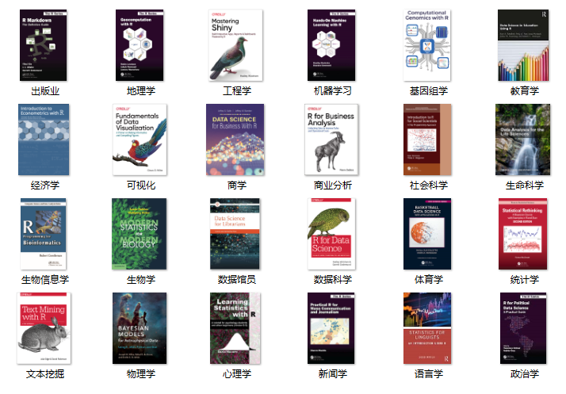
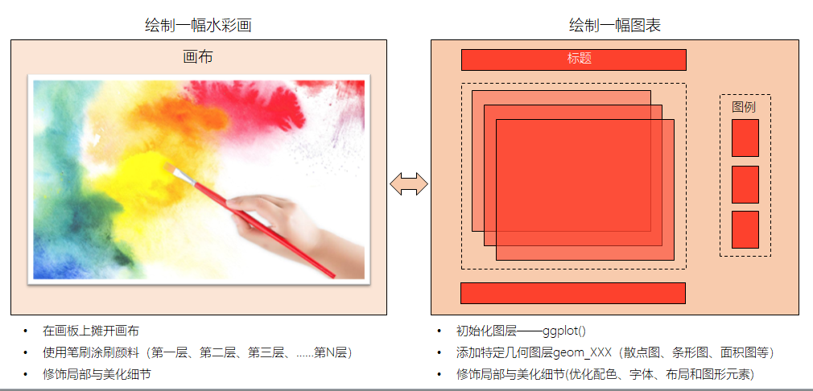

```{r, include = F}
# This is the recommended set up for flipbooks
# you might think about setting cache to TRUE as you gain practice --- building flipbooks from scratch can be time consuming
knitr::opts_chunk$set(
  fig.width = 6, 
  fig.pos = "center",
  fig.align = "center",
  dpi = 300,
  message = FALSE, 
  warning = FALSE, 
  comment = "", 
  cache = F
  )
library(flipbookr)
library(tidyverse)
```


## 今天的内容

- 明确 R 能给我们生活带来什么？
  - 什么是 R 语言？
  - 什么是 Tidyverse 集成包？
  - 社会科学为什么选择 R？

  
<br>

- 十分钟上手R语言
  - 需要一台能联网的电脑
  - 安装R + Rstudio
  - 安装宏包
  


---
class: center, middle
# 一、什么是 R 语言？


---
## R那些事

- 1992年，新西兰奥克兰大学统计学教授 Ross Ihaka 和 Robert Gentleman，为了方便给学生教授统计学课程，他们设计开发了R语言（为什么叫R语言呢？）

```{r echo=FALSE, out.width = '55%'}
knitr::include_graphics(path = "images/R_inventor.png")
```

---

## R是一门编程语言


- R 是一门用于统计分析，图形表示和报告展示的编程语言:

> R is not a statistical software. 
>
> It is a programming language that is great at statistics!

- R 跟进统计学最前沿的信息
- R 拥有顶尖水准的制图功能，尤其是{ggplot2}诞生之后
- R 是完全免费的
- R 应用广泛，拥有丰富的库包，为我们打开不同世界的大门
- R 有活跃而且友好的社区(\#rstats)，代码有问题或者BUG出现，网上一般都能找到答案


---

## R 的前世今生

- 2000年，R1.0.0 发布
- 2004年，第一届国际useR!会议（随后每年举办一次）
- 2005年，ggplot2宏包（2018.8 - 2019.8下载量超过 1.3 亿次）
- 2012年，R2.15.2 发布
- 2013年，R3.0.2 发布, CRAN上的宏包数量5026个
- 2016年，Rstudio公司推出 tidyverse 宏包（数据科学当前最流行的R宏包）
- 2017年，R3.4.1 发布，CRAN上的宏包数量10875个
- 2019年，R3.6.1 发布，CRAN上的宏包数量15102个
- 2020年，R4.0.0 发布，CRAN上的宏包数量16054个
- 2022年，R4.2.0 发布，CRAN上的宏包数量18586个


[Available Packages](https://cran.r-project.org/web/packages/)

---

## R语言应用

```{r echo=FALSE, out.width = '70%'}

```


---

## R 路上的大神

2019 年 8 月，国际统计学年会将考普斯总统奖（被誉为统计学的诺贝尔奖）奖颁给 tidyverse 的作者

```{r echo=FALSE, out.width = '50%', fig.pos= "left"}
knitr::include_graphics("images/hadley-wickham.jpg")
```

- [Hadley Wickham](http://hadley.nz/)
- R路上的大神
- 一个改变了R语言的人

<!-- 十年前R语言不算是一门很好的语言，很难学，语法也不够严谨。那个时候，大家都喜欢是SPSS，但hadley-wickham化腐朽为神奇，把一门很烂的语言，变成了数据科学的核心语言，不仅改变了R语言，而且改变了我们思维方式，让我们的生活更便捷。 -->

---

## 数据科学的流程

<!-- 所有的环节都在一个脚本下完成 -->

Hadley Wickham将[数据科学流程](https://r4ds.had.co.nz/)分解成6个环节

```{r echo=FALSE, out.width = '75%', dpi = 300}
knitr::include_graphics(path = "images/data-science-explore.png")
```
.footnote[[(Grolemund & Wickham, *R for Data Science*, 2017)](https://r4ds.had.co.nz/)]

---

## 数据科学的流程

<!-- Hadley Wickham不仅仅是定义了一个流程，而是为流程的每个环节都开发了相应的宏包 -->

Hadley Wickham将[数据科学流程](https://r4ds.had.co.nz/)分解成6个环节，每个环节都开发了相应的宏包

```{r out.width = '70%', echo = FALSE}
knitr::include_graphics("images/tidyverse.png")
```


---

##  Tidyverse 集成包

<!-- Tidyverse是一系列R包的集合，其成员有点像漫威家族的超级英雄一样，各显神通，从数据导入到预处理，再到高级转化、可视化、建模和展示，每一个环节都覆盖。 -->
```{r echo=FALSE, out.width = '70%'}
knitr::include_graphics("images/tidyverse_packages.png")
```

[Tidyverse](https://www.tidyverse.org/)是一系
列 R 包的集合，包含了dplyr、ggplot2、tidyr、stringr等，从数据导入预处理，再到高级转化、可视化、建模和展示统统覆盖。


---
## R 语言社区

- Tidyverse由于其代码清晰可读的编程风格，得到越来越多人的喜爱。

- 以下是这些宏包，最近一天的下载量

```{r}
library(cranlogs)

cran_downloads(package = c("ggplot2", "dplyr", "tidyr", "rmarkdown", "purrr")) 
```


---
class: center, middle

# 二、社会科学为什么选择 R？


---
class: center, middle
# 社会科学需要统计

---
## 社会科学需要统计

```{r echo=FALSE, out.width = '45%'}
knitr::include_graphics("images/social_science.jpg")
```

.red[.center[往往用统计的，都不是学统计的]]


---
## 统计建模是R语言看家本领

<!-- R 语言是统计编程的第一语言，统计分析是它的看家本领，它的强大自然不用多说。R语言生态已经非常成熟，从线性模型到生存分析，从频率学派到贝叶斯模型，它统统搞定。 -->

R语言生态已经非常成熟，从线性模型到生存分析，从频率学模型到贝叶斯模型，它统统搞定。

<br>

| 模型                | 宏包                                   |             
|:--------------------|:---------------------------------------|
| Generalized linear  | `stats`, `biglm`, `MASS`, `robustbase` | 
| Mixed effects       | `lme4`, `nlme`, `glmmTMB`, `MASS`      |
| Econometric         | `pglm`, `VGAM`, `pscl`, `survival`     | 
| Bayesian            | `brms`, `blme`, `MCMCglmm`, `rstan`    | 
| Machine learning    | `mlr`, `caret`, `h2o`, `tidymodels`    | 

<br>
- <https://cran.r-project.org/web/views/>
- <https://www.tidymodels.org/>
- <https://mc-stan.org/>


---

<!-- 除了建立各种模型，R语言社区还提供了丰富的辅助宏包，比如 -->

## 直接生成**发表级别**的表格（复制到论文即可）

```{r, out.width = '70%', dpi = 600}
library(tidyverse)
library(survival)
library(gtsummary)

coxph(Surv(ttdeath, death) ~ trt + grade + age, trial) %>%
  tbl_regression(exponentiate = TRUE)
```


---

## 模型有了，不知道怎么写论文？

```{r, eval=FALSE}
library(report)

model <- lm(Sepal.Length ~ Species, data = iris)

report(model)
```


```{r echo=FALSE, out.width = '80%', dpi = 600}

```

---

## 将偷懒进行到极致吧，谁帮我敲模型的公式

<!-- 我个人觉得这个宏包的价值，除了偷懒，更重要的是可以验证我们是否把模型理解正确了 -->

```{r}
library(equatiomatic)

mod <- lm(mpg ~ cyl + disp, mtcars)
```


```{r}
mod
```
--

```{r, results="asis"}
extract_eq(mod, use_coefs = TRUE) #<<
```


---
class: center, middle
# 社会科学需要可视化


---

## 社会科学需要可视化

```{r echo=FALSE, out.width = '65%'}
knitr::include_graphics("images/HotlineDrake1.jpg")
```

.red[.center[没有好看的皮囊，没人愿意了解你的灵魂]]


---

## ggplot2 是颜值担当

<!-- ggplot2 如雷贯耳，这个不用太多介绍。很多人学习R语言就是冲着ggplot2画图来的，甚至是先闻{ggplot2}之名，后才知道有R语言。ggplot2 画图确实好看，可以说是tidyverse家族中名副其实的颜值担当。 -->

```{r out.width = '90%', echo = FALSE, dpi = 600}

```

- <https://ggplot2.tidyverse.org/> 
- <https://r-graph-gallery.com/> 
- <https://www.dataviz-inspiration.com/> 

---

## ggplot2中的图层思想

```{r out.width = '90%', echo = FALSE, dpi = 600}

```


---

## ggplot2 可视化  

如果你 get "图层思想"，可以很轻松画出各种图形

--

.pull-left[

```{r plot0, echo = TRUE, eval = FALSE}
ggplot()
```

]

--

.pull-right[
```{r, echo=FALSE, out.width= "80%", dpi = 300}
ggplot()
```
]

---

## ggplot2 可视化 

如果你 get "图层思想"， 可以很轻松画出各种图形


.pull-left[

```{r plot1, echo = TRUE, eval = FALSE}
ggplot(mpg, aes(x = displ, y = hwy)) #<<
```

]


.pull-right[
```{r, echo=FALSE, out.width= "80%", dpi = 300}
ggplot(mpg, aes(x = displ, y = hwy)) 
```
]


---

## ggplot2 可视化 

如果你 get "图层思想"， 可以很轻松画出各种图形


.pull-left[

```{r plot2, echo = TRUE, eval = FALSE}
ggplot(mpg, aes(displ, hwy)) +
  geom_point()  #<<
```

]


.pull-right[
```{r, echo=FALSE, out.width= "80%", dpi = 300}
ggplot(mpg, aes(displ, hwy)) +
  geom_point()
```
]


---

## ggplot2 可视化 

如果你 get "图层思想"， 可以很轻松画出各种图形


.pull-left[

```{r plot3, echo = TRUE, eval = FALSE}
ggplot(mpg, aes(displ, hwy)) +
  geom_point(aes(color = class))  #<<
```

]


.pull-right[
```{r, echo=FALSE, out.width= "80%", dpi = 300}
ggplot(mpg, aes(displ, hwy)) +
  geom_point(aes(color = class))
```
]


---

## ggplot2 可视化

如果你 get "图层思想"， 可以很轻松画出各种图形


.pull-left[

```{r plot4, echo = TRUE, eval = FALSE}
ggplot(mpg, aes(displ, hwy)) +
  geom_point(aes(color = class)) +
  geom_smooth(method = "lm")  #<<
```

]


.pull-right[
```{r, echo=FALSE, out.width= "80%", dpi = 300}
ggplot(mpg, aes(displ, hwy)) +
  geom_point(aes(color = class)) +
  geom_smooth(method = "lm")
```
]


---

## ggplot2 可视化

理解图层思想后，可以使用一些明星级的宏包来偷懒

```{r, echo=FALSE}
library(survival)
fit <- survfit(Surv(time, status) ~ sex, data = lung)
```


.left-code[
```{r plot-label, eval=FALSE}
library(survminer)

fit %>%
  ggsurvplot(
  data = lung, 
  size = 1,                 
  palette = c("#E7B800", "#2E9FDF"),
  conf.int = TRUE,          
  pval = TRUE,              
  risk.table.col = "strata",
  legend.labs = c("Male", "Female"),    
  risk.table.height = 0.25, 
  ggtheme = theme_bw()     
)
```
]

--

.right-plot[
```{r plot-label-out, ref.label="plot-label", echo=FALSE, out.width="80%", dpi = 600, fig.asp= 0.78}

```
]


---

## ggplot2 可视化

理解图层思想后，可以使用一些明星级的宏包来偷懒


.left-code[
```{r plot-label2, eval=FALSE}
library(palmerpenguins)
library(ggstatsplot)

penguins %>% 
  ggbetweenstats( 
    x = species,
    y = bill_length_mm,
    pairwise.comparisons = TRUE,
    pairwise.display = "all",
    var.equal = TRUE
  )

```
]

--

.right-plot[
```{r plot-label-out2, ref.label="plot-label2", echo=FALSE, out.width="90%", dpi = 600, fig.asp= 0.75}

```
]


---
class: center, middle
# 社会科学需要编程


---
## 社会科学需要编程

```{r out.width = '60%', fig.align='center', echo = FALSE}
knitr::include_graphics("images/R_Excel.png", dpi = 150)
```

.red[.center[现在小学生都开始学编程了]]


---
## Tidyverse是人类语言，非常适合编程探索

<!-- 代码可读性强，简单易懂 -->

--

.pull-left[

假定数据长成这个样子

```{r, echo = FALSE}
library(lubridate)

weather <- ggridges::lincoln_weather %>%
  mutate(date = ymd(CST)) %>% 
  select(date, temp = `Mean Temperature [F]`) 
  
weather %>% 
  head(8) %>% 
  knitr::kable() 
```

]

--

.pull-right[

大家猜猜这段代码的含义呢？

```{r, eval = FALSE}
library(tidyverse)

summary_monthly_temp <- weather %>% 
  group_by(month) %>% 
  summarize(
    mean    = mean(temp), 
    std_dev = sd(temp)
  )
```
]


---

`r chunk_reveal("my_tbl", break_type = "auto", chunk_options = "fig.asp = 0.6", widths = c(1.2, 1))`

```{r my_tbl, include = FALSE}
weather %>%
  mutate( month = month(date) ) %>% # 提取月份
  group_by(month) %>%               # 按月进行分组
  summarize(                        
    mean    = mean(temp),           # 统计每月气温均值和标准差
    std_dev = sd(temp)
  )
```


---
## 生成发表级别的表格


```{r}
library(gtsummary)

weather %>%
  mutate( month = month(date) ) %>%
  select( month, temp) %>%
  filter(month < 7) %>% 
  tbl_summary(
    by = month,
    statistic = list(all_continuous() ~ "{mean} ({sd})"),
    digits = list(temp ~ c(1, 1))
   )
  
```


---
class: center, middle
# 社会科学需要可重复性


---
## 社会科学需要可重复性

```{r echo=FALSE, out.width = '70%'}
knitr::include_graphics("images/nature_editorial.png")
```

.red[.center[论文，要公布原始数据和分析代码]]


---

## 可重复性催生了新的编程范式 --- ⽂学化编程

<!-- Tidyverse还有一点让我非常喜欢的是，它可以将文本内容、统计结果与分析图表“编织”成一份可重复性文档，从开始的数据到最后的报告，一站式服务，让我们从繁琐的复制粘贴中解脱出来，整个过程非常便捷，而且充满乐趣。 也称之为文学化编程，初一看，这两词有点不大，完全是两个不关的学科词汇，但他们终于牵手，而且是强强联手。 -->


```{r echo=FALSE, out.width = '85%', fig.pos= "center", dpi = 600}

```

.center[⽂学化统计编程 = 写作(prose) + 编程(code) + knitr(编织)]


---
## 从R到文档

```{r echo=FALSE, out.width = '55%', dpi = 600}
knitr::include_graphics("images/code_chunks.png")
```


---
## 渲染成各种格式

```{r echo=FALSE, out.width = '85%', fig.cap= "图片来源 https://uc-r.github.io/r_markdown", dpi = 600}
knitr::include_graphics("images/rmarkdown_generate.gif")
```


---
## R语言之美，你值得拥有

<br>
<br>
<!-- 总之，Tidyverse 强大、优雅，好学、好看，非常值得学习。 -->


| 序号 	| 内容          	| 特性     	| 评价 	| 
|------	|---------------	|----------	|------	|
| 1    	| 统计分析      	| 看家本领 	| 好用 	|
| 2    	| ggplot2画图   	| 颜值担当 	| 好看 	| 
| 3    	| tidyverse语法 	| 人类语言 	| 好学 	| 
| 4    	| 文学化编程    	| 方便快捷 	| 好玩 	| 


---

## 一见钟情，还是相见恨晚？

```{r echo=FALSE, out.width = '65%', dpi = 600}
knitr::include_graphics("images/meme.png")
```


---
class: center, middle
# 关于学习

---
## 我们的课程不会枯燥

```{r echo=FALSE, out.width = '30%'}
knitr::include_graphics("images/data_science.jpg")
```

- 提出一个科学问题，用数学语言加以描述，最后用代码实现
- 数据科学是为社会科学服务的，我们会有很多案例
- 编程是工具，统计是灵魂，专业是核心


---
## 关于学习


我很少使用

$$
f(x)=\frac{1}{\sqrt{2 \pi}} e^{-\frac{1}{2} x^{2}}
$$

更多的是

```{r, eval = FALSE}
library(tidyverse)
summary_monthly_temp <- weather %>%
  group_by(month) %>%
  summarize(
    mean = mean(temp),
    std_dev = sd(temp)
  )
```


---
## 关于学习

### 课程目标

-   训练数据思维，提升编程技能，培养创新能力

### 学习方法

-   **问题驱动型学习**
-   多实践（光看李小龙的电影，是学不会功夫的）
-   把R看做是知识学习的**脚手架**，不是 learning R，而是 learning with R.

### 课件内容

- [https://github.com/perlatex/data-analysis-with-r](https://github.com/perlatex/data-analysis-with-r)


---
## 关于学习

### 授课方式

-  边写代码边讲，大家同步练习，运行结果截图到QQ群

-  课堂是师生共同构建的，欢迎大家交流可能的应用场景或者需求，我们相互学习，共同进步。


### QQ交流群

```{r echo=FALSE, out.width = '25%'}

```

---
## 推荐参考书

- 教程
  -  [数据科学中的R语言 https://bookdown.org/wangminjie/R4DS/](https://bookdown.org/wangminjie/R4DS/)

- 推荐参考书
  -  [《R for Data Science》](https://r4ds.had.co.nz/), Hadley Wickham and Garret Grolemund, 2017
  - 《Beyond Multiple Linear Regression: Applied Generalized Linear Models and Multilevel Models in R》, Paul Roback and Julie Legler, 2021
  - 《Statistical Rethinking: A Bayesian Course with Examples in R and STAN》,  Richard McElreath, 2020
  - 《Regression and Other Stories》, Andrew Gelman, Cambridge University Press. 2020


---
## 让R语言成为最有收获感的一门课

```{r echo=FALSE, out.width = '70%'}
knitr::include_graphics("images/Hobbit.jpg")
```


---
class: center, middle

# 感谢 R 语言之美!

本幻灯片由 R 包 [**xaringan**](https://github.com/yihui/xaringan) 和 [**flipbookr**](https://github.com/EvaMaeRey/flipbookr) 生成


