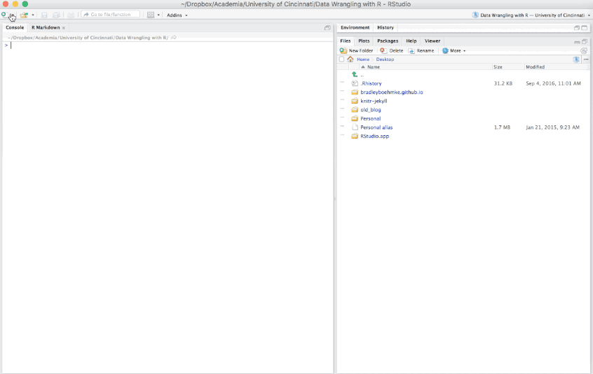
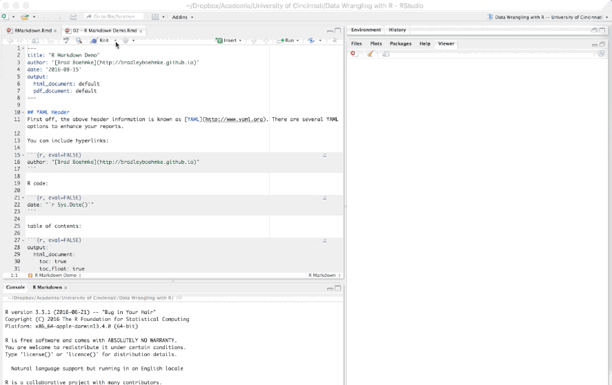

```{r setup, include=FALSE}
knitr::opts_chunk$set(
  echo = TRUE,
  message = FALSE,
  warning = FALSE,
  fig.align = "center"
)
```


## ⼏个问题

- 会⽤Word？
- 会⽤LaTeX？
- ⽤R/Python编程？
- ⽤Rstudio？
- 需要出分析报告？
- 这个幻灯⽚是⽤什么做的？


---
class: center, middle
# 一、先说编程


---
## 编程⼯具应具备的品质


.left-column[

- ⼊⻔要简单
- 费⽤低廉
- 代码开放/开源
- ⽆平台限制
- 分析⾼效
- 计算⾼速: 并⾏与分布式
- 可视化容易⽽强
- 编程扩展能⼒强

]


--

.right-column[

```{r echo=FALSE, out.width = '60%'}

```

]


---
## R vs. Python vs. Julia, 如何选择?
```{r echo=FALSE, out.width = '80%'}
knitr::include_graphics("images/R-Python-Julia.png")
```

.center[<https://insights.stackoverflow.com/trends?tags=r%2Cpython%2Cjulia>]


---
## 我更喜欢 R 的优雅

R语言是用于统计分析，图形表示和报告的编程语言:

- R 是一个统计编程语言（statistical programming）
- R 可运行于多种平台之上，包括Windows、UNIX 和 Mac OS X
- R 拥有顶尖水准的制图功能
- R 是免费的
- R 应用广泛，拥有丰富的库包
- 活跃的社区(`#rstats`)


---
## R 生态已经成熟

```{r echo=FALSE, out.width = '75%'}
knitr::include_graphics("images/tidyverse_packages.png")
```

[Tidyverse](https://www.tidyverse.org/)是一系
列 R 包的集合，包含了dplyr、ggplot2、tidyr、stringr等，从数据导入预处理，再到高级转化、可视化、
建模和展示统统覆盖。


---
## R 语言社区

Tidyverse其代码清晰可读的编程风格，得到越来越多人的喜爱。

```{r}
library(cranlogs)
cran_downloads(package = c("ggplot2", "dplyr", "tidyr", "rmarkdown", "purrr"))
```


---

## R语言在不同领域的应用

```{r echo=FALSE, out.width = '65%'}
knitr::include_graphics("images/Rbooks.png")
```


---
class: center, middle
# 二、再谈谈写作


---
## 写作⼯具的选择


- Word: 所见即所得，看得见踏实

- LaTeX : 所想即所得。
  - 世界上90%的书是TeX排出来的
  - 太重，TeX Live 2022 安装包有 4GB
  - 学习成本也比较高


- Markdown: 轻量级的标记语⾔，轻便易⽤


---
## Markdown: 轻便易⽤

.pull-left[

使⽤ Markdown 的优点

- 专注你的⽂字内容⽽不是排版样式。
- 轻松的导出 HTML、PDF 和本⾝的 .md ⽂件。
- 纯⽂本内容，兼容所有的⽂本编辑器与字处理软件。
- 可读，直观。
- 适合所有⼈的写作语⾔。

]


.pull-right[
```{r, out.width = '100%', echo = FALSE, fig.pos = "center"}
knitr::include_graphics("images/markdown_text.png")
```
]


---

## 强强联⼿

```{r echo=FALSE, out.width = '75%'}
knitr::include_graphics("images/rmarkdown.png")
```

[Quarto, the next generation of RMarkdown](https://quarto.org)

---
## 伟大的工匠，谢益辉

```{r echo=FALSE, out.width = '100%'}

```

- knitr, bookdown, blogdown, pagedown, xaringan, and tinytex的作者

- <https://yihui.org/>


---
class: center, middle

# 三、⽂学化统计编程


---

## ⽂学化编程
```{r echo=FALSE, out.width = '85%'}
knitr::include_graphics("images/markdown_hedgehog.png")
```

.center[⽂学化统计编程 = 写作(prose) + 编程(code) + knitr(编织)]


---
## ⽂学化编程作⽤

- ⽂学化统计编程可实现
    1. 由⽂本与R代码合⼆为⼀
    2. 实现混合编程，达到交互式可视化
    3. 结果随数据与代码⾃动更新
    4. 避免复制与粘贴⼯作，实现可重复的研究/分析
    
- ⼤趋势:
    - 数据的统计分析报告⾃动智能⽣成！
    - ⼤幅提升数据分析的效率


> 以上文字来源，汤银才教授讲座PPT(2021-05-13)


---
## R markdown⽂档构成的核心元素

.left-column[

1. 头文件(YAML)
2. 文本(text)
3. 代码(chunks)

]

.right-column[

```{r, out.width = '65%', echo = FALSE, fig.pos = "center"}

```

]


---
## 渲染与呈现形式

```{r echo=FALSE, out.width = '55%'}
knitr::include_graphics("images/code_chunks.png")
```


---
## 如何创建

```{r echo=FALSE, out.width = '85%'}

```
图片来源<https://uc-r.github.io/r_markdown>


---
## 如何运行

```{r echo=FALSE, out.width = '85%'}

```

图片来源<https://uc-r.github.io/r_markdown>


---
## 支持行内公式和独立行公式

```latex
The well known Pythagorean theorem $x^2 + y^2 = z^2$ was proved to 
be invalid for other exponents. Meaning the next equation has no integer solutions:

$$
\begin{aligned}[t]
f(u) & =\sum_{j=1}^{n} x_jf(u_j)&\\
     & =\sum_{j=1}^{n} x_j \sum_{i=1}^{m} a_{ij}v_i&\\
     & =\sum_{j=1}^{n} \sum_{i=1}^{m} a_{ij}x_jv_i
\end{aligned}
$$


```


The well known Pythagorean theorem $x^2 + y^2 = z^2$ was 
proved to be invalid for other exponents. 
Meaning the next equation has no integer solutions:

$$
\begin{aligned}
f(u) & =\sum_{j=1}^{n} x_jf(u_j)&\\
     & =\sum_{j=1}^{n} x_j \sum_{i=1}^{m} a_{ij}v_i&\\
     & =\sum_{j=1}^{n} \sum_{i=1}^{m} a_{ij}x_jv_i
\end{aligned}
$$


---
## 表格示例

```{r echo=FALSE, out.width = '85%'}

```


---

## 图形示例

.pull-left[

````{verbatim}
```{r, out.width = '95%'}
library(dplyr)
library(ggplot2)
library(palmerpenguins)

penguins %>% 
  ggplot(aes(x = bill_length_mm, y = bill_depth_mm, color = species)) +
  geom_point() +
  geom_smooth(method = "lm")
```
````

]

.pull-right[

```{r, out.width = '95%', echo=FALSE}
library(dplyr)
library(tidyr)
library(ggplot2)
library(palmerpenguins)

penguins %>% 
  drop_na() %>% 
  ggplot(aes(x = bill_length_mm, y = bill_depth_mm, color = species)) +
  geom_point() +
  geom_smooth(method = "lm")
```


]


---

## 也可插入自己喜欢的图片

````{verbatim}
```{r out.width = '25%', fig.align='center', fig.cap='全智贤我的女神', echo = F}

```
````


```{r out.width = '25%', fig.align='center', fig.cap='全智贤我的女神', echo = F}

```


---
class: center, middle
# 四、实战示例


---
## 案例

- 做笔记
- 写报告
- 写书(bookdown)
- 写论⽂(期刊模板)
- 写毕业论⽂(本科/硕博)
- 做幻灯⽚(beamer/html/ppt)


---
class: center, middle

# 感谢 R 语言的美!

本幻灯片由 R 包 [**xaringan**](https://github.com/yihui/xaringan) 和 [**flipbookr**](https://github.com/EvaMaeRey/flipbookr) 生成


