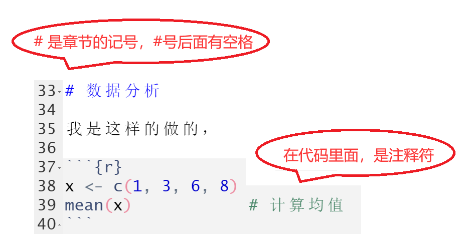

# 关于`#`

`#` 是R语言的代码**注释符**。对于一行代码，机器会自动跳过`#`后面的内容， 因此，我们在`#`后面可以写上对代码的注解。

- 在 *.R 文件里，全部都是代码区，因此 `#` 的作用就是注释符。
- 在 *.Rmd 里，除了有代码区，也有文本区，因此，
  - 在代码区（Chunck），`#`仍然是注释符的作用。
  - 但在文本区，不是代码了，`#`作为章节的记号，`# ` 记为章，`## ` 记为节，注意`#`后面会有空格。


```{r, out.width='80%', fig.align='center', echo = F}

```


# 数据分析

我是这样的做的，巴拉巴拉

```{r}
x <- c(1, 3, 6, 8)
mean(x)            # 计算均值
```

