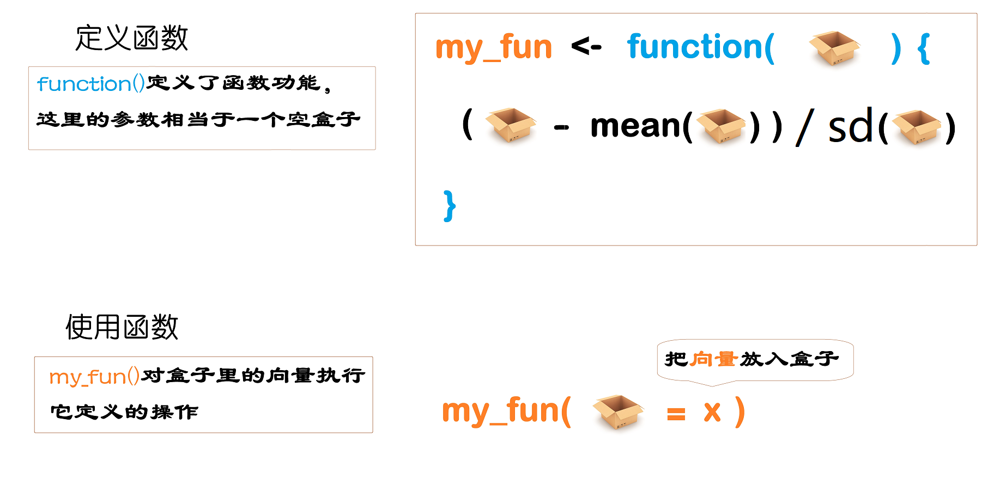

上一节课我们提到向量操作符，体会到了向量化操作的强大，事实上，向量操作符是一种函数。R 语言的强大就在于它拥有丰富的函数，这里的函数和我们高中数学中的函数 `y = f(x)` 没什么区别。

比如，y = x * 2

- 高中数学: x 是一个数
- R 语言里: x 是一个糖葫芦(一系列的数)


## 基础函数

R 语言内置了很多统计函数，比如对于向量`x`
```{r}
x <- c(2, 7, 8, 9, 3)
```

打印向量`x`
```{r}
print(x)
```


求向量元素之和
```{r}
sum(x)
```


**课堂扩展**

```{r}
y <- c(TRUE, TRUE, TRUE, FALSE)
sum(y)
```


求向量元素的均值
```{r}
mean(x)
```

求向量元素的标准差
```{r}
sd(x)
```

求向量元素的对数
```{r}
log(x)
```


找出向量元素中的最小值
```{r}
min(x)
```

找出向量元素中的最大值
```{r}
max(x)
```

计算向量元素的个数
```{r}
length(x)
```

对向量元素大小排序
```{r}
sort(x)
```

```{r}
sort(x, decreasing = TRUE)
```

找出向量元素的唯一值，就是给出**去重后**的数据
```{r}
a <- c("a", "b", "b", "c", "d", "a", "g", "c", "d")
unique(a)
```


判断是否为数值型/字符串型
```{r}
x <- c(2, 7, 8, 9, 3)
is.numeric(x)
is.character(x)
is.logical(x)
```

**课堂练习**，为什么`is.na()`返回5个值，而`is.numeric()`只返回1个值？
```{r}
is.na(x)
```


判断向量元素是否大于5
```{r}
x <- c(2, 7, 8, 9, 3)
x > 5
```


关系运算符，本质上也是函数
```{r}
`>`(x, 5)
```


条件判断
```{r}
ifelse(x > 5, "big", "small")
```


## 向量的函数

用在向量上的函数，可以分为向量化函数(vectorized function)和汇总类函数(summary function)，

```{r, out.width = '100%', fig.align='center', echo = FALSE, fig.cap='这两类函数在 Tidyverse 框架中，应用非常广泛。'}
knitr::include_graphics("images/vector-function.png")
```

当然，也会有例外，比如`unique()`函数，它返回的向量通常不会与输入的向量等长，既不属于向量化函数，也不属于汇总类函数。


## 课堂练习

- 向量`x <- c(2, 7, 8, 9, 3)`的平方，加上5
```{r}
x <- c(2, 7, 8, 9, 3)
x^2 + 5
```

- 向量的元素减去其均值
```{r}
x <- c(2, 7, 8, 9, 3)
x - mean(x)              # 向量中心化
```


- 向量标准化（向量减去其均值之后，除以标准差）
```{r}
x <- c(2, 7, 8, 9, 3)
(x - mean(x)) / sd(x)    # 向量标准化
```


- 如果想对更多的向量，也做标准化处理呢？

```{r}
y <- c(1, 5, 7, 8, 9, 3)
(y - mean(y)) / sd(y)
```


```{r}
z <- c(4, 7, 7, 8, 9, 3, 9, 6)
(z - mean(z)) / sd(z)
```


隔壁班的小朋友也拿着糖葫芦过来，要做标准化，简单重复的过程，有没有一劳永逸的方法？


## 自定义函数

```{r}
my_std <- function(v) {
   (v - mean(v)) / sd(v)
 }
```

```{r}
my_std(v = x)
my_std(v = y)
my_std(v = z)
```

现在`my_std` 是一个糖葫芦**瘦身机器**了（放进一个胖瘦不匀称的糖葫芦，出来一个身材匀称的糖葫芦）。

```{r, echo = FALSE}

```


## 自定义函数的部件

自己定义函数，需要四个关键部件：

```{r, echo = FALSE}

```


- 创建，由`function()`创建一个函数
- 参数，由`function()`括号里指定函数的参数，比如`function(args)`中的参数为 `args` 
- 函数主体，一般情况下，在`function()`后跟随一对大括号`{ }`，在大括号里声明具体函数功能，在代码最后一行，可以用`return()`返回计算后的值。当然，如果函数的目的只是返回最后一行代码计算的值，这个`return`可以省略。
- 函数名，`function() { }` 赋值给新对象，比如这里的`name`，相当于给函数取一名字，方便以后使用。
- 函数调用，外部的向量值**传递**给函数的参数，参数代入函数内部运算后，返回结果

```{r, eval=FALSE}
my_std(v = c(1, 3, 5, 7, 9)) 

# 如果函数只有一个参数，可以偷懒
my_std(c(1, 3, 5, 7, 9))
```


用生活化的例子理解函数：

想象`my_std()`是一台洗衣机，我们把脏衣服放入滚筒，放入洗衣液，开启开关，就开始洗洗洗，最后返回干净的衣服。


## 案例

- 根据下面的数学表达式，写出函数

$$
\mathrm{rescale}(x) = \frac{x_i- min(x)}{max(x) - min(x)} 
$$


```{r}
my_scale <- function(v){
  (v - min(v)) / (max(v) - min(v))    # 向量归一化
}

y <- c(2, 7, 8, 9, 3, 6, 8, 12, 6, 9)

my_scale(y)
```


## 安装宏包、加载宏包和调用函数

宏包（packages）好比您买回家的电视机、洗衣机、冰箱，每个家电都有自己的功能

```{r, echo = FALSE}
knitr::include_graphics("./images/what-is-install.jpg")
```


安装宏包有以下常见两种方式：

1. 宏包已是稳定版本，并已经提交到CRAN的（这是一个专门存放宏包的网络平台），方法为 `install.packages("dplyr")`
2. 宏包处于开发状态，我们尝鲜的，方法为 `devtools::install_github("hadley/emo")`


## 使用宏包的函数

各种宏包为我们准备了不同的函数，我们在使用前**一般要先加载该宏包**，比如后面章节我们会用的`dplyr`宏包中的`select()`函数，它用于选取数据框的某列。

使用宏包函数的第一种方法
```{r, eval=FALSE}
library(dplyr)
select(starwars, height)
```

但是如果加载多个宏包，也可能遇到其它宏包也有`select()`函数的情形，比如`MASS`和`skimr`。如果同时加载了`dplyr`，`MASS`和`skimr`三个宏包，若在程序中使用`select()`函数，就会造成混淆和报错。

```{r, eval=FALSE}
library(dplyr)
library(MASS)
select(starwars, height)
```

这个时候就需要给每个函数指定是来源哪个宏包，具体方法就是在宏包和函数之间添加`::`，比如`dplyr::select()`，`skimr::select()` 或者`MASS::select()`。


因此，使用宏包函数的第二种方法
```{r}
dplyr::select(starwars, height)
```


> 一班有个王大宝，二班也有个叫王大宝，他们一起参加活动，点名的时候就需要加上班级，`一班::王大宝`，放在R语言就是 `package::function()`.


至此，我们接触到了三类函数

- **自带的函数**
- **自定义的函数**
- **宏包的函数**


**课堂练习**：生活中，买买买；R中就是，装装装。

- 有一个宏包的名字叫 `palmerpenguins`，请大家安装。
- 这个宏包，包含了数据集penguins，请问如何使用该数据集？


