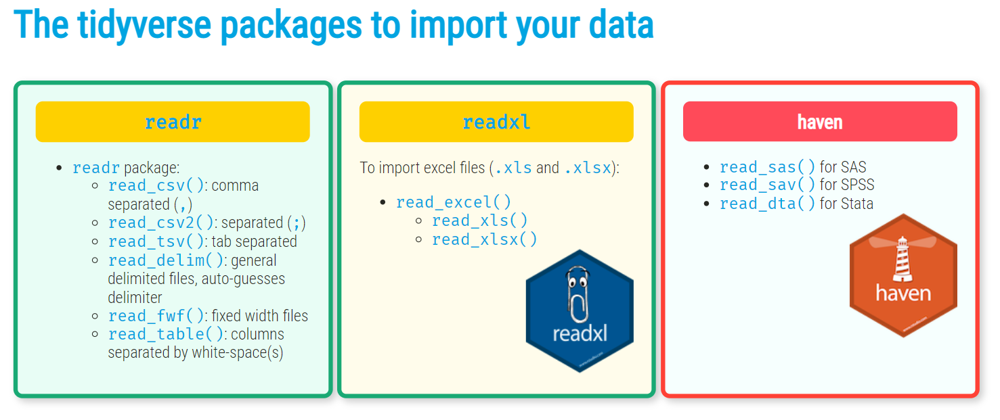
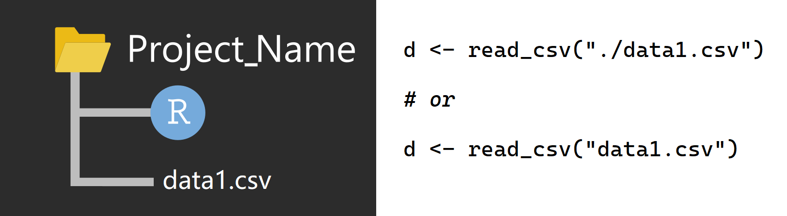
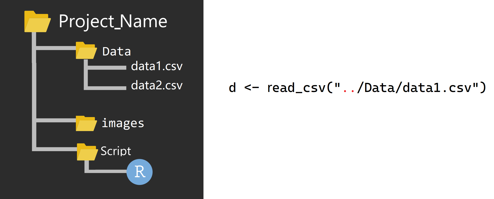
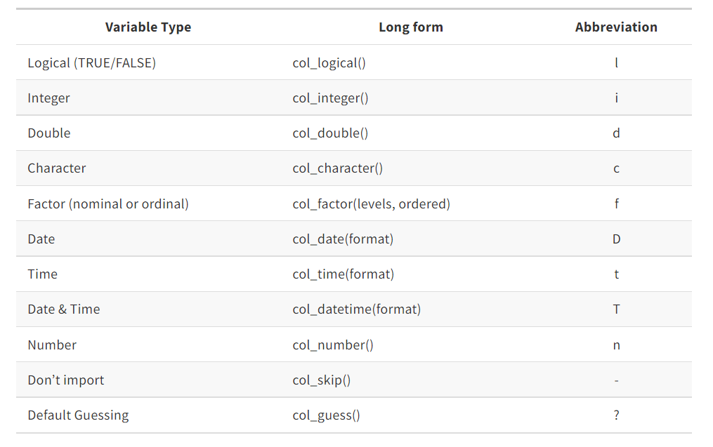

```{r setup, include=FALSE}
options(digits = 3)
knitr::opts_chunk$set(
  comment = "#>",
  echo = TRUE,
  collapse = TRUE,
  message = FALSE,
  warning = FALSE,
  out.width = "100%",
  fig.align = "center",
  fig.asp = 0.618, # 1 / phi
  fig.show = "hold"
)
```


# 项目管理

## 项目管理
- 把项目所需的文件（代码、数据、图片等），放在一个文件夹里

```{r readr-1, out.width='50%', fig.align='center', echo=FALSE}
knitr::include_graphics("./images/Rproject.png")
```

- 放在一个没有中文和空格的路径下

## 文件夹命名

**推荐**我自己的文件夹命名习惯 (项目名+日期)，注意这里不要有**中文和空格**, 比如下面风格的就比较好 

- `homework20220618`
- `project20220618`
- `Emotional_experiment20220618` 
- `R_ladies_20220520`
- `R_You_with_Me`


# 数据读取

## 读取数据 

R语言提供了很多读取数据的函数。
\footnotesize

|文件格式               | **R** 函数                                        |
|:----------------------|:--------------------------------------------------|
|.txt                   | `read.table()`                                    |
|.csv                   | `read.csv()` and `readr::read_csv()`              |
|.xls and .xlsx         | `readxl::read_excel()` and `openxlsx::read.xlsx()`|
|.sav(SPSS files)       | `haven::read_sav()` and `foreign::read.spss()`    |
|.Rdata or rda          | `load()`                                          |
|.rds                   | `readRDS()` and `readr::read_rds()`               |
|.dta                   | `haven::read_dta()` and `haven::read_stata()`     |
|.sas7bdat(SAS files)   | `haven::read_sas()`                               |
|Internet               | `download.file()`                                 |


## Tidyverse 各种宏包^[图片来源 <https://rworkshop.uni.lu/>]

```{r, out.width='100%', fig.align='center', echo=FALSE}

```


<!-- ## 文件路径 -->

<!-- 在读取文件时，路径的写法有如下方式（以图像文件"a.jpg"为例） -->

<!-- - 如果以当前项目文件为中心，图片在当前目录，它的路径 -->
<!-- "./a.jpg" -->

<!-- - 如果以当前项目文件为中心，图片在下一层目录的images文件夹 -->
<!-- "./images/a.jpg" -->

<!-- - 如果以当前项目文件为中心，图片在上一层目录下，它的路径 -->
<!-- "../a.jpg" -->

<!-- - 如果以当前项目文件为中心，图片在上一层目录的images文件夹，它的路径 -->
<!-- "../images/a.jpg" -->

<!-- - 从根目录出发，访问D盘的images文件"b.jpg"图片，它的路径 -->
<!-- "D:/images/b.jpg" -->


## 文件路径，推荐使用相对路径

```{r, out.width='100%', fig.align='center', echo=FALSE}

```

## 文件路径

```{r, out.width='100%', fig.align='center', echo=FALSE}
knitr::include_graphics("./images/path02.png")
```

```{r, eval=FALSE, echo=FALSE}
d <- read_csv("./Data/data1.csv")
```


## 文件路径

```{r, out.width='100%', fig.align='center', echo=FALSE}

```

```{r, eval=FALSE, echo=FALSE}
d <- read_csv("../Data/data1.csv")
```


## 范例 

```{r}
library(readr)
wages <- read_csv("./data/wages.csv")
wages
```

<!-- ## 数据探索 -->
<!-- ```{r} -->
<!-- dplyr::glimpse(wages) -->
<!-- ``` -->

## 变量类型

```{r, out.width='85%', fig.align='center', echo=FALSE}

```

<!-- ## 范例  -->
<!-- ```{r} -->
<!-- library(readxl) -->
<!-- d <- read_excel("../demo_data/olympics.xlsx") -->
<!-- tail(d, 6) -->
<!-- ``` -->

<!-- ## 数据探索 -->
<!-- ```{r} -->
<!-- library(visdat) -->
<!-- vis_miss(d) -->
<!-- ``` -->


## 指定类型
\footnotesize
```{r}
wages <- read_csv(
  file = "./data/wages.csv",
  col_types = list(
    col_double(),
    col_double(),
    col_character(),
    col_character(),
    col_character(),
    col_guess()
  )
)
```


```{r, echo=FALSE}
wages
```


## 习题

读取demo_data文件夹下kidiq.RDS文件


变量含义：

| 变量       	| 含义             	|
|------------	|------------------	|
| kid_score  	| 小孩考试分数     	|
| mom_hs     	| 母亲是否完成高中 	|
| mom_iq     	| 母亲IQ值         	|
| mom_age    	| 母亲年龄         	|

请说出数据框中每一列的变量类型

