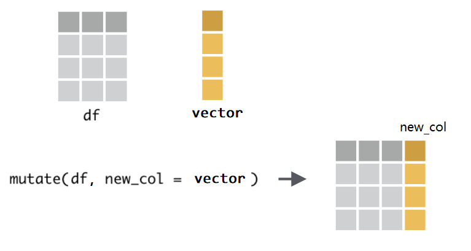
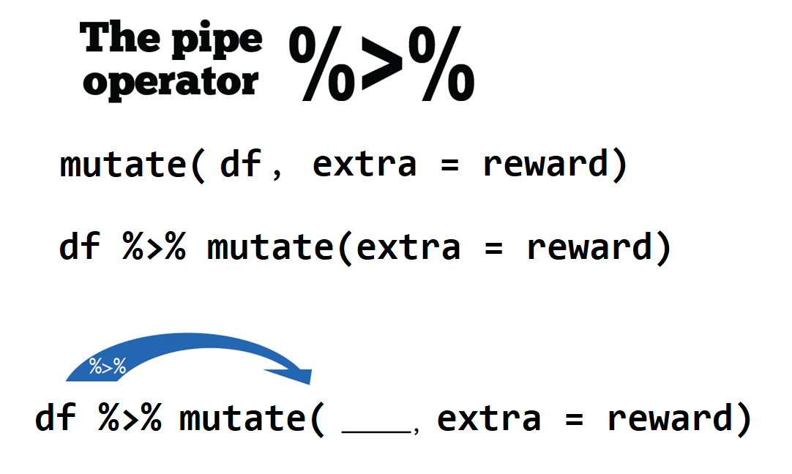

本章我们介绍被誉为“瑞士军刀”的数据处理工具dplyr宏包。首先，我们加载该宏包
```{r message = FALSE, warning = FALSE}
library(dplyr)
```


我们假定这里有三位同学的英语和数学成绩

```{r message = FALSE, warning = FALSE}
df <- readr::read_csv("./data/score.csv")
df
```


## 新增一列 `mutate()` 

同学们表现不错，分别得到额外的奖励分 `c(2, 5, 9, 8, 5, 6)`

```{r}
reward <- c(2, 5, 9, 8, 5, 6)
```


那么，如何把奖励分加到表中呢？用`mutate()`函数可以这样写

```{r}
mutate(.data = df, extra = reward) 
```


`mutate()`函数的功能是给数据框新增一列，使用语法为 `mutate(.data = df, name = value)`：


- 第一个参数`.data`，接受要处理的数据框，比如这里的`df`。
- 第二个参数是`Name-value`对, 比如`extra = reward`，
   - 等号左边，是我们为新增的一列取的名字，比如这里的`extra`，因为数据框每一列都是要有名字的；
   - 等号右边，是打算并入数据框的向量，比如这里的`reward`，它是装着学生成绩的**向量**。注意，向量的长度，
      - 要么与数据框的行数等长，比如这里向量长度为6；
      - 要么长度为1，即，新增的这一列所有的值都是一样的(循环补齐机制)。
     
```{r}
mutate(.data = df, extra = 10) 
```

```{r, out.width = '60%', echo = FALSE}

```


另外，如果想同时新增多个列，只需要提供多个`Name-value`对即可，比如
```{r, eval=FALSE}
mutate(df, 
       extra1 = c(2, 5, 9, 8, 5, 6),
       extra2 = c(1, 2, 3, 3, 2, 1),
       extra3 = c(8)
       ) 
```

注意到，如果对已有的变量名重新赋值，相当于替换原有的列
```{r}
mutate(df, score = 100) 
```


## 管道 `%>%`

实际运用中，我们经常要使用函数，比如计算向量`c(1:10)`所有元素值的和

```{r}
sum(c(1:10))
```


现在有个与上面的等价的写法，就是使用管道操作符 `%>%`
```{r}
c(1:10) %>% sum()
```


也可以使用它的弟弟 `|>`
```{r}
c(1:10) |> sum()
```


通过下图图示可以看到管道操作符就像生产线上的传送带一样，将数据运入函数中。
```{r out.width = '45%', echo = FALSE}
knitr::include_graphics("images/pipe1.png")
```


当执行多个函数操作的时候，管道操作符 `%>%` 就显得格外方便，代码可读性也更强。比如

```{r}
sqrt(sum(abs(c(-10:10))))
```

使用管道操作符
```{r}
c(-10:10) %>% abs() %>% sum() %>% sqrt()
```


在Windows系统中可以通过`Ctrl + Shift + M` 快捷键产生 `%>%`，苹果系统对应的快捷键是`Cmd + Shift + M`。


```{r, out.width = "100%", echo=FALSE}
knitr::include_graphics("images/keyboard/keyboard_pipe.png")
```


那么，之前增加学生奖励分成绩的语句 `mutate(df, extra = reward)`，也可以使用管道

```{r out.width = '65%', echo = FALSE}

```


```{r}
# using `%>%`
df %>% mutate(extra = reward) 
```


管道的优势非常明显
```{r}
df %>% 
  mutate(extra = reward) %>% 
  mutate(extra1 = 1:6) %>% 
  mutate(extra2 = 20)
```


## 向量函数与mutate()

如果想构建新的一列，希望它是score的平方
```{r}
df %>% 
  mutate(new_col = score^2)
```


也可自定义`calc_square()`函数
```{r}
calc_square <- function(x) {
  x^2
}

df %>% 
  mutate(new_col = calc_square(score))
```

**课堂练习**，向量中心化

```{r}
centralized <- function(x) {
  x - mean(x)
}

df %>% 
  mutate(new_col = centralized(score))
```


计算总分，也很方便
```{r}
df %>% 
  mutate(extra = reward) %>% 
  mutate(total = score + extra)
```


## 保存为新的数据框

现在有个问题，此时 `df` 有没发生变化？是否包含额外的奖励分呢？
事实上，此时`df`并没有发生改变，还是原来的状态。


现在我们把添加奖励分、计算总成绩和保存结果这三个步骤一气呵成的完成
```{r}
df <- df %>% 
  mutate(extra = reward) %>% 
  mutate(total = score + extra)

df
```


```{r out.width = '65%', echo = FALSE}
knitr::include_graphics("images/Pipe_baking_magrittr_backAssign.gif")
```


## 选取列 `select()`

`select()` 顾名思义选择，就是选择数据框的某一列，或者某几列。


我们以上面学生成绩的数据框为例，这里选择`name`列 
```{r}
df %>% select(name)
```


如果要选取多列，就再多写几个列名就行了
```{r}
df %>% select(name, extra)
df %>% select(name, score, extra, total)
```


如果不想要某列，可以在变量前面加 `-` 或者 `!`，两者的结果是一样的。
```{r}
df %>% select(-type)
df %>% select(!type)
```


也可以通过位置索引进行选取，比如选取头三列
```{r}
df %>% select(1, 2, 3)
df %>% select(2:3)
df %>% select(-2)
```


选取以"s"开头的列
```{r}
df %>% select(starts_with("s"))
```


选取以"e"结尾的列
```{r}
df %>% select(ends_with("e"))
```


选取含有以"score"的列
```{r}
df %>% select(contains("score"))
```


当然，也可以通过变量的类型来选取，比如选取所有字符串类型的列
```{r}
df %>% select(where(is.character))
```


选取所有数值类型的列
```{r}
df %>% select(where(is.numeric))
```


选取所有数值类型的并且以"t"开头的列
```{r}
df %>% select(where(is.numeric) & starts_with("t"))
```


选取以"s"开头或者以"e"结尾的列
```{r}
df %>% select(starts_with("s") | ends_with("e"))
```


选取以"s"开头之外的列
```{r}
df %>% select(!starts_with("s"))
```

选取所有列
```{r}
df %>% select(everything())
```

选取最后一列
```{r}
df %>% select(last_col())
```

## 修改列名 `rename()`

用`rename()`修改列的名字, 具体方法是和`mutate()`一样，等号左边是新的变量名，右边是已经存在的变量名。
比如，我们这里将`total`修改为`total_score`

```{r}
df %>% 
  rename(total_score = total)
```

## 调整列的顺序 `relocate()`

```{r}
df %>% 
  relocate(total)
```

```{r}
df %>% 
  relocate(total, .after = name)
```


```{r}
df %>% 
  relocate(total, .before = type)
```


## 筛选 `filter()`

用`filter()`函数筛选出符合特定条件的某些行(keep的意思)。比如，


把**成绩等于90分的**同学筛选出来
```{r}
df %>% filter(score == 90)
```


把**成绩大于等于80分的**同学筛选出来
```{r}
df %>% filter(score >= 80)
```


英语成绩高于75分的所有条目
```{r}
df %>% filter(type == "english", score >= 75)
```


### 常见的错误
`filter()`函数两个常见的错误:

- 把 "=" 误认为 "=="
```{r, eval=FALSE}
df %>% filter(type = "english")   # error
df %>% filter(type == "english")
```

- 忘记引号
```{r, eval=FALSE}
df %>% filter(type == english)   # error
df %>% filter(type == "english")
```


### 逻辑算符

多个参数的情形，本质上是**逻辑与**的关系，即每个条件都要满足

```{r}
df %>% filter(type == "english", score >= 75)
```

等价于
```{r}
df %>% filter(type == "english" & score >= 75)
```

也存在使用**逻辑或**的情形。比如，找出**成绩等于70**或者**成绩等于90**的行
```{r}
df %>% filter(score == 70 | score == 90)
```


找出成绩等于70，或者等于80，或者等于90的行
```{r}
df %>% filter(score == 70 | score == 80 | score == 90)
```


与上等价，但更有效的方法
```{r}
df %>% filter(score %in% c(70, 80, 90))
```


当然还可以配合一些函数使用，比如把最高分的同学找出来
```{r}
df %>% filter(score == max(score))
```


把成绩高于均值的找出来
```{r}
df %>% filter(score > mean(score))
```

**课堂练习**，找出考试成绩的平方大于 8000 的那些记录

```{r}
df %>% 
  mutate(score_square = score^2) %>% 
  filter(score_square > 8000)
```

或者
```{r}
df %>% filter(score^2 > 8000)
```


## 统计汇总 `summarise()`

`summarise()`函数非常强大，主要用于统计汇总，往往与其他函数配合使用。比如计算所有同学考试成绩的均值 

```{r}
df %>% 
  summarise(mean_score = mean(score))
```


计算所有同学考试成绩的标准差
```{r}
df %>% 
  summarise(sd_score = sd(score))
```


还可以同时完成多个统计
```{r}
df %>%
  summarise(
    mean_score   = mean(score),
    median_score = median(score),
    n            = n(),         # 返回当前数据框的行数 
    sum          = sum(score)
  )
```


`summarise()` 与 `mutate()` 一样，也是创建新的变量（新的一列），仍然遵循**等号左边是新的列名，等号右边是基于原变量的统计**。
区别在于，`mutate()`是在原数据框的基础上增加新的一列；而`summarise()`在成立的新的数据框中创建一列。


## 分组统计 `group_by()` 

实际运用中，`summarise() `函数往往配合`group_by()`一起使用，即，先分组再统计。

比如先按照学生`name`分组，然后每组求平均
```{r}
df %>%
  group_by(name) %>%
  summarise(
    mean_score = mean(total),
    sd_score   = sd(total)
  )
```

**课堂练习** 统计每个学科的均值和标准差


**思考** 以下代码的含义
```{r}
df %>%
  group_by(type, name) %>%
  summarise(
    mean_score = mean(total),
    sd_score   = sd(total)
  )
```

## 排序 `arrange()`

`arrange()`这个很好理解的，就是按照某个变量排序。

比如按照考试总成绩从低到高排序，然后输出 

```{r}
df %>% arrange(total)
```


默认情况是从小到大排序，如果从高到低降序排序呢，有两种方法，

第一种方法是在用于排序的变量前面加 `-` 号，
```{r}
df %>% arrange(-total)
```


第二种方法可读性更强些，需要使用`desc()`函数
```{r}
df %>% arrange(desc(total))
```


也可对多个变量依次排序。比如，我们先按学科类型排序，然后按照成绩从高到底降序排列
```{r}
df %>% 
  arrange(type, desc(total))
```


## 左联结 `left_join()` 

实际操作中，也会遇到数据框合并的情形。假定我们已经统计了每个同学的平均成绩，存放在`df1`

```{r}
df1 <- df %>% 
  group_by(name) %>% 
  summarise( 
    mean_score = mean(total) 
  )
df1
```


现在我们又有新一个数据框`df2`，它包含一些同学的年龄信息
```{r}
df2 <- tibble(
      name = c("Alice", "Bob", "Dave"),
      age =  c(12, 13, 14)
)
df2
```


可以使用 `left_join()`函数 把两个数据框`df1`和`df2`合并连接在一起。这两个数据框是通过姓名`name`连接的，因此需要指定`by = "name"`，代码如下


```{r}
left_join(df1, df2, by = "name")
```


用管道 `%>%`写，可读性更强

```{r}
# using %>%
df1 %>% left_join(df2, by = "name")
```

大家注意到最后一行Carol的年龄是`NA`， 大家想想为什么呢？


## 右联结 `right_join()`

我们再试试`right_join()`  
```{r}
df1 %>% right_join(df2, by = "name")
```

Carol同学的信息没有显示？ Dave 同学显示了但没有考试成绩？大家想想又为什么呢？


**思考**，以下代码是否与上一代码等价？
```{r}
df2 %>% left_join(df1, by = "name")
```


## 满联结 `full_join()`

有时候，我们不想丢失项，可以使用`full_join()`，该函数确保条目是完整的，信息缺失的地方为`NA`。 

```{r}
df1 %>% full_join(df2, by = "name")
```


```{r}
df2 %>% full_join(df1, by = "name")
```


## 内联结 `inner_join()`

只保留name条目相同地记录，含有筛选功能
```{r}
df1 %>% inner_join(df2, by = "name")
```

