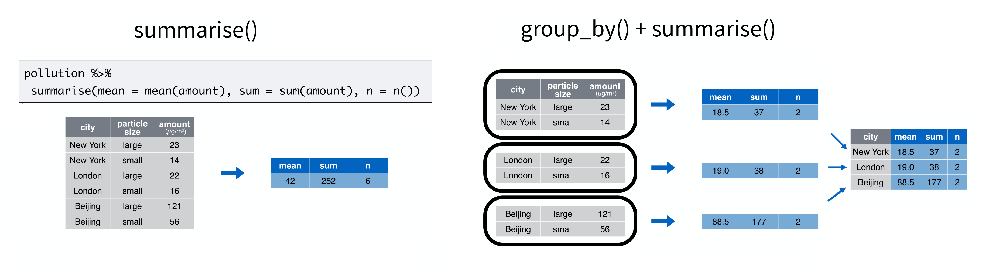
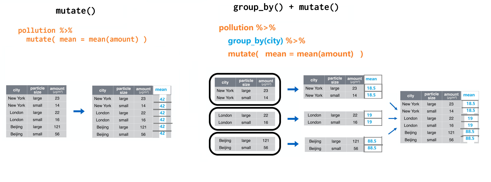

```{r, message=FALSE, warning=FALSE}
library(tidyverse)

pollution <- tibble::tribble(
       ~city,   ~size, ~amount,
  "New York", "large",      23,
  "New York", "small",      14,
    "London", "large",      22,
    "London", "small",      16,
   "Beijing", "large",     121,
   "Beijing", "small",      56
  )

pollution
```


## group_by() + summarise()
```{r}
pollution %>% 
  summarise(
    mean = mean(amount),
    sum = sum(amount),
    n = n()
  )
```


```{r}
pollution %>% 
  group_by(city) %>% 
  summarise(
    mean = mean(amount),
    sum = sum(amount),
    n = n()
  )
```


```{r out.width = '100%', echo = FALSE}

```


## group_by() + mutate()
```{r}
pollution %>% 
  mutate( mean = mean(amount) )
```


```{r}
pollution %>% 
  group_by(city) %>% 
  mutate( mean = mean(amount)  )
```

```{r out.width = '100%', echo = FALSE}

```


## group_by() + filter()
```{r}
pollution %>% 
  filter( amount > mean(amount)  )
```


```{r}
pollution %>% 
  group_by(city) %>% 
  filter( amount > mean(amount)  )
```


