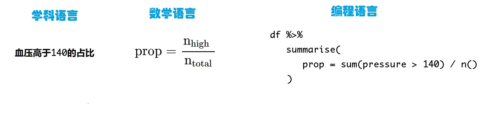

# 个人观点

数据科学的定义：提出一个科学问题，用数学语言加以描述，最后用代码实现。

- 也就说，数据科学是三种语言(学科语言、数学语言、计算机语言)的融合。
- 解决具体问题的时候，需要三种语言(思维方法)相互转换。这种**转换**对初学者而言是最困惑的地方。


```{r, out.width = '100%', echo = FALSE}

```


$$
\begin{align*}
\operatorname{prop} & = \frac{\operatorname{n_{high}}}{\operatorname{n_{total}}} \\
\end{align*}

$$


```{r}
library(tidyverse)
raw <- read_csv("./demo_data/diabetes.csv")

df <- raw %>% 
  select(age, gender, height, weight, pressure = bp.1s, glyhb) %>% 
  drop_na()

df
```


```{r}
df %>% 
  summarise( 
    prop = sum( pressure > 140) / n()  
  )
```

## 提高问题的难点

- 不同性别，高血压的占比

```{r}
df %>% 
  group_by(gender) %>% 
  summarise( 
    prop = sum( pressure > 140) / n()  
  )
```


- 40岁以上的人群，不同性别的高血压的占比
```{r}
df %>% 
  filter(age > 40) %>% 
  group_by(gender) %>% 
  summarise( 
    prop = sum( pressure > 140) / n()  
  )
```


- 40岁以上的人群，不同性别的高血压和糖尿病的占比。
（糖化血红蛋白 glyhb > 7.0 通常被视为糖尿病的阳性诊断）
```{r}
df %>% 
  filter(age > 40) %>% 
  group_by(gender) %>% 
  summarise( 
    prop = sum( pressure > 140 & glyhb > 7.0) / n()  
  )
```


- 可视化
```{r}
df %>% 
  filter(age > 40) %>% 
  mutate(p_and_g = str_c(pressure > 140, glyhb > 7.0)) %>% 
  ggplot(aes(x = pressure, y = glyhb)) +
  geom_point(aes(color = p_and_g)) +
  geom_vline(xintercept = 140) +
  geom_hline(yintercept = 7) 
```

