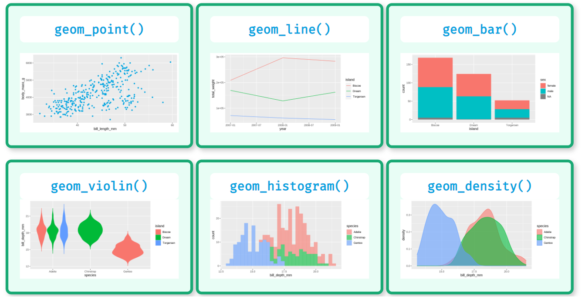

## 作业

- 查看手册，弄懂参数含义
```{r}
tibble(x = letters[1:3], y = x) %>% 
  ggplot(aes(x, y)) +
  geom_point(
    aes(colour = x),
    show.legend = FALSE,
    size = 100, alpha = 0.9
  )
```


- 画出图中的6个图形

```{r, out.width = '100%', fig.align='left', echo = FALSE}

```
