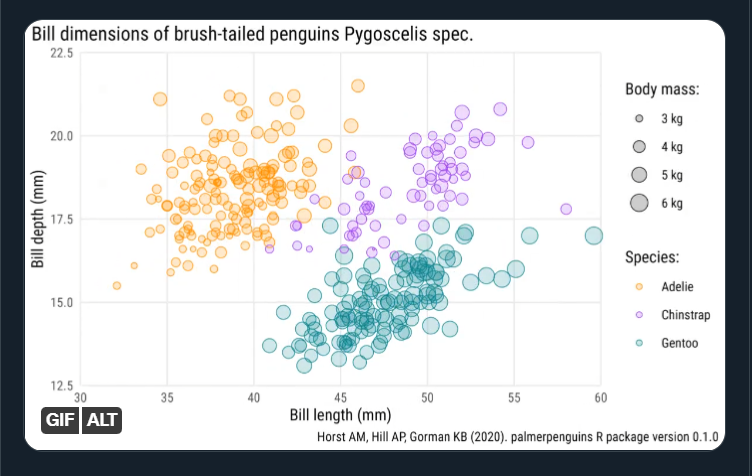

# 作业

第一眼看到这张图，就被吸引住了，挺好看的，我们重复试试。

```{r, echo=FALSE, out.width='85%'}

```


# 开始
```{r setup, include=FALSE}
library(tidyverse)
library(palmerpenguins)
penguins <- penguins %>% drop_na()
```


```{r}
library(showtext)
font_add_google(name = "Roboto Condensed")

showtext_auto()
font_families()
```


