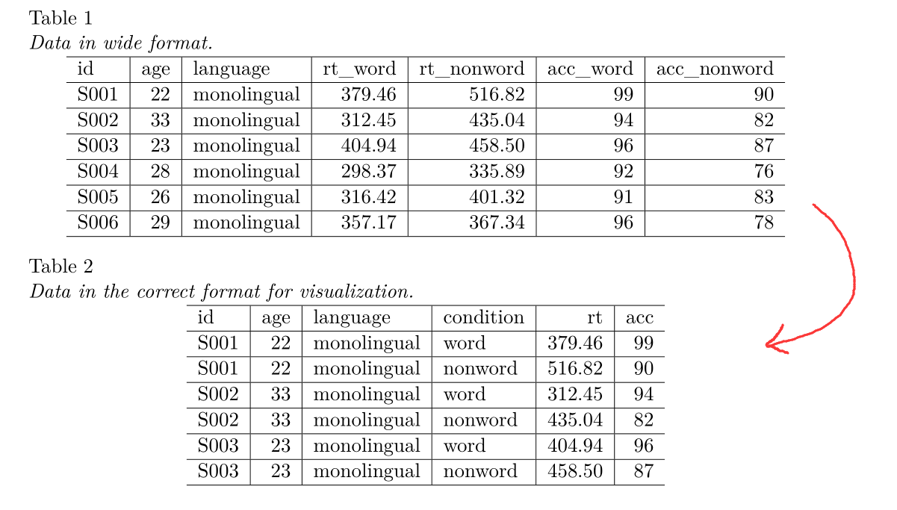
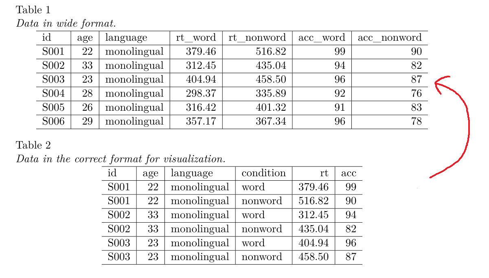

# 数据

这是一份[心理学专业](https://osf.io/bj83f/)的数据

```{r, message=FALSE, warning=FALSE}
library(tidyverse)

df <- read_csv("./demo_data/ldt_data.csv")
df
```


- id:          被试的编号
- age:         被试的年龄
- language:    掌握几种语言 (1 = monolingual, 2 = bilingual) 
- rt_word:     识别word的反应时（毫秒）
- rt_nonword:  识别non-word的反应时（毫秒）
- acc_word:    识别word的准确性 
- acc_nonword: 识别non-word的准确性 


# 思考1

如何将Table 1 变成 Table 2的格式?

```{r, out.width = '100%', fig.align='left', echo = FALSE}

```

## 尝试1
```{r}
df %>%
  pivot_longer(
    cols = rt_word:acc_nonword,
    names_to = "name",
    values_to = "value"
  ) %>%
  separate(name, into = c("index", "condition")) %>%
  pivot_wider(
    names_from = index,
    values_from = value
  )
```

## 尝试2

通常情况下，`names_to` 指定一个字符串向量当作新的一列的列名，用于装 `cols` 指定的旧名。

当然，在 `names_sep` 或者 `names_pattern` 的协助下，也可以指定多个新列名。

```{r}
long <- df %>%
  pivot_longer(
    cols = rt_word:acc_nonword,
    names_sep = "_",
    names_to = c("index", "condition"),
    values_to = "value"
  )

long
```


```{r}
long %>%
  pivot_wider(
    names_from = "index",
    values_from = "value"
  )
```

## 尝试3

更简洁的方法

```{r}
df %>%
  pivot_longer(
    cols = rt_word:acc_nonword,
    names_to = c(".value", "condition"), # .value 代替了 values_to 
    names_sep = "_"
  )
```

旋转成长表格，一般要指定`names_to`和 `values_to`. 
但是，如果 `names_to` 指定的字符串向量中含有".value"，那么旧的列名在经过 `names_sep` 或 `names_pattern` 分割后，".value"所对应或匹配的那部分，被当作新value列的列名，`values_to`就可以省略了。即 .value 代替了 values_to 


```{r}
longer <- df %>%
  pivot_longer(
    cols = rt_word:acc_nonword,
    names_to = c(".value", "condition"),
    names_pattern = "(.*)_(.*)"
  )
longer
```


# 思考2

如何将Table 2 变回 Table 1的格式？

```{r, out.width = '100%', fig.align='left', echo = FALSE}

```

```{r}
longer
```


```{r}
longer %>%
  pivot_wider(
    names_from = condition,
    values_from = c(rt, acc),
    names_sep = "_"
  )
```


或者
```{r}
longer %>%
  pivot_wider(
    names_from = condition,
    values_from = c(rt, acc),
    names_glue = "{condition}_{.value}"
  )
```
