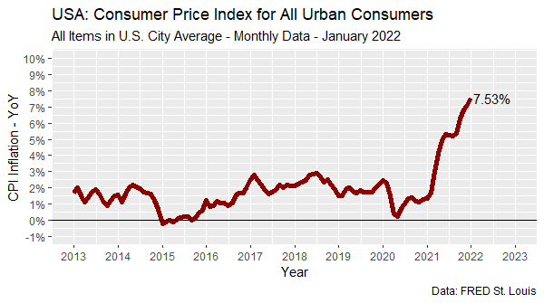
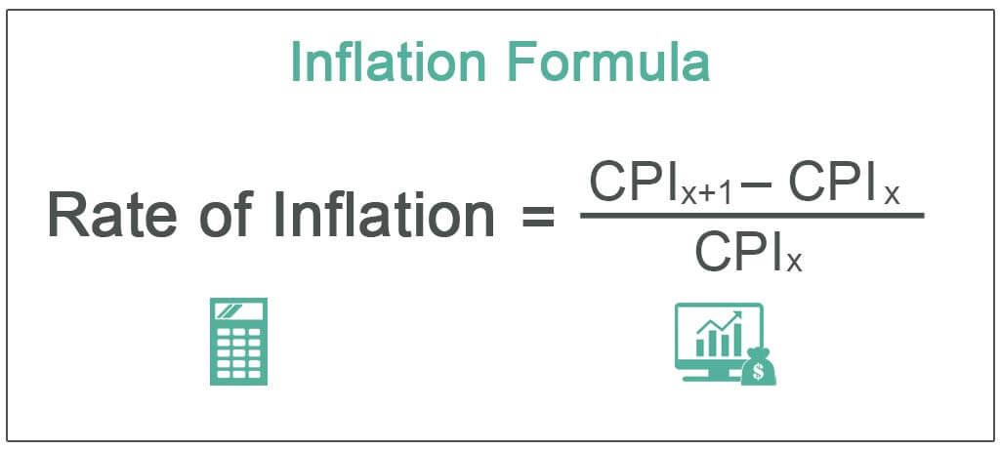

## 缘起

前几天看新闻的时候，发现一张图，勾起了我的兴趣，打算重复这张图

```{r, out.width = '75%', echo = FALSE, fig.pos = "center"}

```


## 寻找数据

原图的右下角告诉了数据来源，于是找到这个网站<https://fred.stlouisfed.org/series/CPIAUCSL>，可获取数据


## 通货膨胀率公式

```{r, out.width = '75%', echo = FALSE, fig.pos = "center"}

```