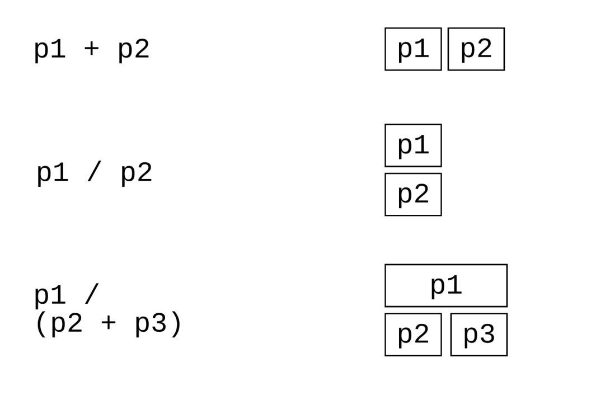

## 图片组合

```{r, message=FALSE, warning=FALSE}
library(tidyverse)
library(palmerpenguins)
penguins <- penguins %>% drop_na()
penguins
```


```{r}
g1 <- penguins %>% 
  ggplot(aes(bill_length_mm, body_mass_g, color = species)) +
  geom_point() + 
  theme_bw(base_size = 14) +
  labs(tag = "(A)", x = "Bill length (mm)", y = "Body mass (g)")
g1
```


```{r}
g2 <- penguins %>% 
  ggplot(aes(bill_length_mm, bill_depth_mm, color = species)) +
  geom_point() + 
  theme_bw(base_size = 14) +
  labs(tag = "(B)", x = "Bill length (mm)", y = "Bill depth (mm)")
g2
```


把两张图组合起来
```{r, fig.width = 12, fig.asp= 0.318}
library(patchwork)

g1 + g2
```


```{r, fig.width = 12, fig.asp= 0.318}
g1 + g2 + plot_layout(guides = "collect")
```

```{r, fig.width = 12, fig.asp= 0.418}
g1 + g2 + plot_layout(guides = "collect") & theme(legend.position = "bottom")
```


patchwork 使用方法很简单，根本不需要记
```{r, echo = F}

```


```{r}
p1 <- penguins %>% 
  ggplot(aes(x = bill_length_mm, y = bill_depth_mm)) +
  geom_point() 


p2 <- penguins %>%
  ggplot(aes(x = species, y = bill_depth_mm)) +
  geom_boxplot() 


p3 <- penguins %>% 
  ggplot(aes(x = bill_depth_mm, y = body_mass_g)) +
  geom_smooth() 


p4 <- penguins %>% 
  ggplot(aes(x = bill_depth_mm)) +
  geom_histogram()

```


```{r}
(p1 | p2 | p3) /
      p4
```


## 更多组合

```{r}
library(cowplot)

plot_grid(p1, p2, labels = c('A', 'B'), label_size = 12)
```


```{r}
plot <- penguins %>% 
  ggplot(aes(x = bill_length_mm, y = bill_depth_mm)) +
  geom_point(aes(colour = species), size = 2, show.legend = FALSE) +
  theme_minimal(base_size = 14)


ggdraw() + 
  draw_image("./images/penguins03.jpg") + 
  draw_plot(plot, scale = 0.6, hjust = -0.1)
```


```{r}
ggdraw() +
  draw_image("./images/penguins03.jpg", scale = 0.9) +
  plot_grid(plot)
```


## 字体

如果想使用不同的字体，可以用`theme()` 的 `element_text()` 函数

- `family`: font family 
- `face`  : bold, italic, bold.italic, plain 
- `color` :
- `size`  : 
- `angle` : 


```{r}
penguins %>%
  ggplot(aes(x = bill_length_mm, y = body_mass_g)) +
  geom_point(aes(color = species)) +
  labs(title = "This is a group of cute little penguins") +
  theme(
    plot.title = element_text(size = 20, face = "bold")
  )
```


想使用指定的字体，可从`C:\Windows\Fonts\`字体中选取，然后用`showtext`宏包加载

```{r}
library(showtext)

# add fonts
font_add(family = "Calibri", regular = "Calibri.ttf")
showtext_auto()


penguins %>%
  ggplot(aes(x = bill_length_mm, y = body_mass_g)) +
  geom_point(aes(color = species)) +
  labs( title = "This is a group of cute little penguins" ) +
  theme(
    plot.title = element_text(family = "Calibri", size = 20, face = "bold")
  )
```


也可使用漂亮的[google字体](https://fonts.google.com/)


```{r, fig.asp = 0.618}
# add fonts
font_add_google(name = "Cherry Cream Soda", family = "cherry")
showtext_auto()


penguins %>%
  ggplot(aes(x = bill_length_mm, y = body_mass_g)) +
  geom_point(aes(color = species)) +
  labs( title = "This is a group of cute little penguins" ) +
  theme(
    plot.title = element_text(family = "cherry", size = 20, face = "bold")
  )
```


```{r, fig.asp = 0.618}
library(showtext)

# add fonts
font_add("heiti", "simhei.ttf")
showtext_auto()
# check
# font_families()

penguins %>%
  ggplot(aes(x = bill_length_mm, y = body_mass_g)) +
  geom_point(aes(color = species)) +
  labs( title = "这是一群可爱的小企鹅" ) +
  theme(
    plot.title = element_text(family = "heiti", size = 20, face = "bold")
  )
```


```{r}
font_add("kaishu", "simkai.ttf")

penguins %>%
  ggplot(aes(x = bill_length_mm, y = body_mass_g)) +
  geom_point(aes(color = species)) +
  labs( title = "这是一群可爱的小企鹅" ) +
  theme(
    plot.title = element_text(family = "kaishu", size = 20, face = "bold")
  )
```

```{r}
ggsave("showtext-example.pdf", width = 7, height = 4, dpi = 300)
```


## 添加标注

```{r}
penguins %>% 
  ggplot(aes(x = bill_length_mm, y = bill_depth_mm)) +
  geom_point() +
  annotate(
    geom  = "text", x = c(55), y = c(14),
    label = c("在这里添加你想说的话，今天好凉快啊~~~"),
    color = "red",
    size  = 4
  )
```


## 交互式

```{r, message = FALSE, warning = FALSE}
library(plotly)  # install.packages("plotly")

penguins <- penguins %>% drop_na()

p <- penguins %>% 
  ggplot(aes(x = bill_length_mm, y = bill_depth_mm, color = species)) +
  geom_point()

ggplotly(p)
```


## 参考

- [R for Data Science](https://r4ds.had.co.nz/) 
- [ggplot2: Elegant Graphics for Data Analysis](https://ggplot2-book.org/)
- [R Graphics Cookbook](https://r-graphics.org/)
- [Fundamentals of Data Visualization](https://serialmentor.com/dataviz/)
- [Data Visualization: A practical introduction](https://socviz.co/)
- [patchwork](https://patchwork.data-imaginist.com/index.html)
- [perfectly align axes](https://wilkelab.org/cowplot/)
- [showtext](https://github.com/yixuan/showtext)