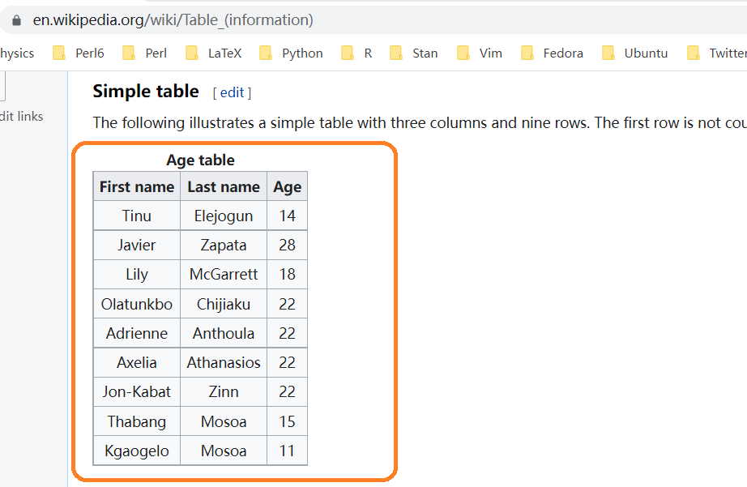
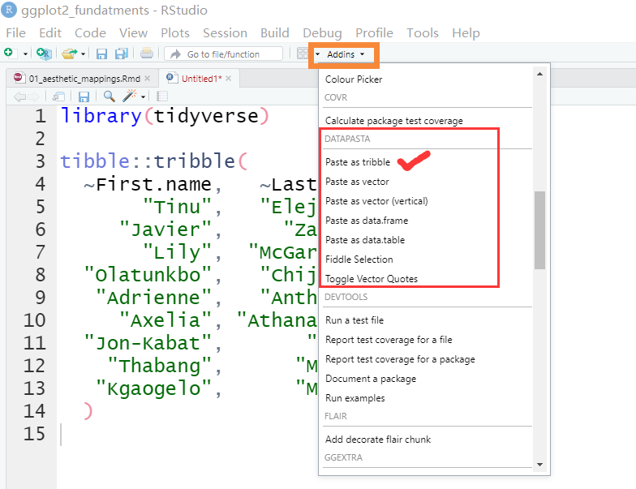

## 用datapasta粘贴小表格

有时候想把excel或者网页上的小表格，放到R里测试下，如果用readr读取excel小数据，可能觉得麻烦，或者大材小用。比如网页<https://en.wikipedia.org/wiki/Table_(information)>有个表格，有偷懒的办法弄到R？

```{r, out.width = '100%', echo = FALSE}

```


推荐一个[方法](https://github.com/MilesMcBain/datapasta)

1、安装`install.packages("datapasta")`
2、鼠标选中并复制网页中的表格
3、在 Rstudio 中的`Addins`找到`datapasta`，并点击`paste as tribble`

```{r, out.width = '100%', echo = FALSE}

```

