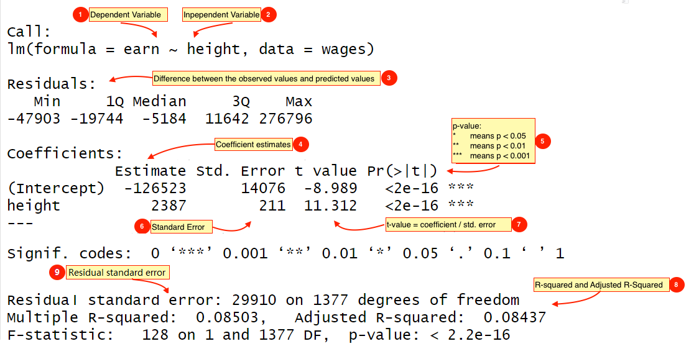

线性模型是数据分析中最常用的一种分析方法。最基础的往往最深刻。

- Everything is regression (t tests, ANOVA, correlation, chi-square, non-parametric)
- The simplest linear regression model


## 从一个案例开始

这是一份肯塔基州赛马的数据集。


```{r message = FALSE, warning = FALSE}
library(tidyverse)
derby <- read_csv("./demo_data/derbyplus.csv")
derby 
```


## 数据预处理

### 变量含义
一般情况下，拿到一份数据，首先要了解数据每个变量的含义，

```{r}
derby %>% glimpse()
```

- `year`      比赛时间
- `winner`    获胜者
- `condition` 赛道状况和类型（fast、good、slow, 人为设计的，类似山地比赛、公路比赛）
- `speed`     获胜者的速度
- `starters`  起跑手数量


### 缺失值检查

检查数据是否有缺失值，这点很重要。

```{r}
# 如何检查数据是否有缺失值？
derby %>%
  summarise(
    year_na       = sum(is.na(year)),
    winner_na     = sum(is.na(winner)),
    condition_na  = sum(is.na(condition)),
    speed_na      = sum(is.na(speed)),
    starters_na   = sum(is.na(starters))
  )
```


程序员都是偷懒的，所以也可以写的简便一点。大家在学习的过程中，也会慢慢的发现tidyverse的函数很贴心，很周到。

```{r}
derby %>%
  summarise(
    across(everything(), ~ sum(is.na(.)))
  ) %>% 
  pivot_longer(
    cols = everything()
  )
```


###  变量简单统计

然后探索下每个变量的分布。

```{r}
derby %>% 
  ggplot(aes(x = speed)) + 
  geom_histogram(binwidth = 0.5, fill = "white", color = "black") + 
  labs(x = "Winning speed (ft/s)", 
       y = "Frequency" ) 
```


```{r}
derby %>% 
  ggplot(aes(x = starters)) + 
  geom_histogram(binwidth = 3, fill = "white", color = "black") + 
  labs(x = "Number of starters", 
       y = "Frequency" )
```


```{r}
derby %>% 
  count(condition) %>% 
  ggplot(aes(x = condition, y = n)) +
  geom_col()
```


大家可以自行探索其他变量的情况。


## 问题

现在提出几个问题，希望大家带着这些问题去探索：

- **获胜速度是否有线性趋势？**

- 获胜速度的增长率是否取决于赛道状况或起跑手的数量？

- 是不是起跑者越多越会跑出好成绩？遇强则强，还是马匹越多挤在一起影响速度？

- 这些关联是否具有统计学意义？统计显著性 vs  统计可探测性

- 我们能预测获胜速度吗？


从统计学的角度回答以上问题，需要引入统计模型。


### 获胜速度是否有线性趋势？


```{r}
derby %>% 
  ggplot(aes(x = year, y = speed)) +
  geom_point() +
  geom_smooth(method = "lm")
```

可视化探索是非常有必要的，图形给出的趋势，非常值得我们通过建立模型加以验证。


假定**获胜速度**视为时间的线性函数，$Y_{i}$ 就是获胜者的速度speed，$i$就是年份，
$$
 Y_{i}=\beta_{0}+\beta_{1}\textrm{Year}_{i}+\epsilon_{i} \quad \textrm{where} \quad \epsilon_{i}\sim \textrm{N}(0,\sigma^2)
$$


先解释一些概念：

- `data = model + error`

- 期望值（模型的值）: 
$$
\hat{Y}_{i}=\hat{\beta}_{0}+\hat{\beta}_{1}\textrm{Year}_{i}
$$

- 残差 (误差项):  代表着**真实速度**与模型给出的**期望速度**之间的**偏差**
$$
\hat{\epsilon}_{i}=Y_{i} - \hat{Y}_{i}
$$


我们的任务是估计**系数**

- $\beta_{0}$ 代表截距

- $\beta_{1}$ 代表斜率


::: {.rmdnote}

模型中的参数($\beta_{0}$, $\beta_{1}$, and $\sigma^2$) 通过最小二乘法计算得出：

> 使得残差的平方和最小

```{r out.width = '85%', echo = FALSE}
knitr::include_graphics("images/best_fit.png")
```

::: 


当然，数据量很大，手算是不现实的，我们借助R语言代码吧


### 使用`lm()` 函数

用R语言代码`lm(y ~ x, data)` 是最常用的线性模型函数，`lm()`是linear model的缩写

`lm`参数很多, 但很多我们都用不上，所以我们只关注其中重要的两个参数

```{r, eval = FALSE}
lm(formula = y ~ x, data = )
```

参数解释说明：

::: {.rmdnote}

* formula：指定回归模型的公式，对于简单的线性回归模型`y ~ x`. 
* ~ 符号：代表“预测”，可以读做“y由x预测”。有些学科不同的表述，比如下面都是可以的
  - `response ~ explanatory`  
  - `dependent ~ independent` 
  - `outcome ~ predictors`
* data：代表数据框，数据框包含了响应变量和独立变量

:::


等不及了，就运行代码吧
```{r}
mod1 <- lm(speed ~ year, data = derby)
```


`lm()`返回赋值给`mod1`. `mod1`是一个叫`lm object`或者叫`类`的东西，我们打印看看，

```{r}
print(mod1)
```

它告诉我们，建立的线性回归模型是

$$
\hat y = 2.053 + 0.026 \times \text{year}
$$


### 模型输出

- 查看详细信息
```{r}
summary(mod1)
```


```{r, echo=FALSE, out.width = '100%'}

```

- 残差
```{r}
resid(mod1) %>% 
  quantile()
```


- 系数
```{r}
coef(mod1)
```

- 系数的置信区间
```{r}
confint(mod1, level = 0.95)
```

- 标准误(Std. Error)。标准误反映的是系数估计的不确定程度。标准误越大，系数估计的不确定越大。
```{r, out.width = '80%', fig.align='center', echo = FALSE}
knitr::include_graphics(path = "images/jhudsl/standard_error.png")
```

- `t value`： 
   t value = 系数/标准误


- $R^2$，拟合优度（Goodness of Fit）是指回归直线对观测值的拟合程度。
```{r}
summary(mod1)$r.squared
summary(mod1)$adj.r.squared
```


- 残差标准误(Residual standard error)

$$
\hat{\sigma}^2 = \sum \hat{\epsilon}^2_{i} / (n-2)
$$ 

```{r}
summary(mod1)$sigma
```


### 模型的解释

**建立一个`lm`模型是简单的，然而最重要的是，我们能解释这个模型。**

`mod1`的解释：

```{r}
mod1
```


根据建立的线性模型，
$$
\hat y = 2.053 + 0.026 \times \text{year}
$$


- 在第0年的时候获胜马匹的速度是2.05英尺/秒（二千年以前，这是一种极端的理论情况）
```{r, eval=FALSE}
derby %>% 
  mutate(yearnew = year - 1896)
```

- 每年（时间增加一个单位）获胜速度增长0.026英尺/秒

- $R^2$ = 0.513意味着该模型能够解释51.3%的获胜速度年度变化


- 关于p value。基于模型成立的条件，假定真实的$\beta_{1} = 0$，那么观察到的$\beta_{1} >= 0.026$ 的概率是 2e-16。p = 2e-16 非常小的概率，这么小的概率的事情，是不可能发生的。所以
   - 或者，样本有问题
   - 或者，假设条件$\beta_{1} = 0$不成立的，即系数$\beta_{1} \neq = 0$
   - 或者，模型假定是错误的(怎么判断？下节课讲)

> 但如果我们已经证明 β 不为零，那么它等于什么。不幸的是，除了从模型中获得的数据之外，我们没有其他数据，因此假设 β = 0.026 是最正确的。


（我很不喜欢这种解释，希望大家拥抱**贝叶斯**吧，那里没有p值和显著性）


