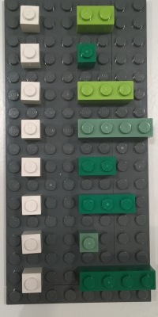

# tibble与data.frame

- tibble和data.frame一样，本质上都是向量构成的列表。如下图所示

```{r, out.width = '75%', echo = FALSE}
knitr::include_graphics("images/dcl/tibble.png")
```


大多情况下，我们接触到的向量是原子型向量(atomic vectors)，所谓原子型向量就是向量元素为单个值，比如 `"a"` 或者 `1`

```{r}
c(1, 3, 8)
c("a", "3", "d")
```

```{r, out.width = '75%', echo = FALSE}
knitr::include_graphics("images/dcl/tibble-atomic.png")
```


# tibble是增强版的data.frame

## `List-columns` (列表列) 

一般情况下，data.frame的一列都是向量，即**向量列**（vector columns）；
而tibble还可以允许某一列为列表(list)，那么列表构成的列，称之为**列表列**（list columns）

```{r, out.width = '75%', echo = FALSE, fig.cap = "Functional Programming by S. Altman, B. Behrman, H. Wickham (CC4 Licence)"}
knitr::include_graphics("images/dcl/tibble-list-col.png")
```

这样一来，**列表列**非常灵活，因为列表元素可以是原子型向量、列表、矩阵或者小的tibble


```{r, out.width = '75%', echo = FALSE, fig.cap = "Functional Programming by S. Altman, B. Behrman, H. Wickham (CC4 Licence)"}
knitr::include_graphics("images/dcl/tibble-list-col-vectors.png")
```

举个好记的例子

```{r, out.width = '75%', echo = FALSE, fig.cap = "Picture by Jennifer Bryan"}

```


```{r}
tibble(
  numbers = 1:8,
  my_list = list(
    a = c("a", "b"),
    b = 2.56,
    c = c("a", "b", "c"),
    d = rep(TRUE, 4),
    d = 2:3,
    e = 4:6,
    f = FALSE,
    g = c(1, 4, 5, 6)
  )
)
```


## nested tibble

tibble的列表列装载数据的能力很强大，也很灵活。除了上面这种方法外，还有其它方法创建和操控有列表列的tibble。

### creating 
假定我们这里有一个tibble， 我们有三种方法可以创建列表列

* `nest()`
* `summarize()` and `list()`
* `mutate()` and `map()`


#### tidyr::nest()
使用`tidyr::nest()`函数，创建有列表列的tibble。 

```{r, out.width = '75%', echo = FALSE, fig.cap = "Functional Programming by S. Altman, B. Behrman, H. Wickham (CC4 Licence)"}
knitr::include_graphics("images/dcl/tibble-list-col-tibbles.png")
```

```{r}
library(tidyverse)
library(palmerpenguins)

df <- penguins %>% 
  drop_na() %>% 
  select(species, bill_length_mm, bill_depth_mm, body_mass_g)
df
```

先分组，然后每一组的体征数据`nest()`聚合成一个数据框，species的3个类别对应3个数据框，放在data这一列下面。此时形成的data这一列，它不是向量，而是列表，因此就叫**列表列**

```{r}
tb <- df %>% 
  group_by(species) %>% 
  nest()

tb
```

`nest()` 为每种species对应的体征数据创建了一个小的tibble

```{r}
tb$data[[1]]
```

可以看到，`tb`的整个`data`列是一个list
```{r}
tb$data %>% typeof()
```

也可以使用 `unnest()` 还原打开
```{r}
tb %>% 
  unnest()
```


可以同时创建多个列表列

```{r}
df %>% 
  group_by(species) %>% 
  nest(data1 = c(bill_length_mm, bill_depth_mm), data2 = body_mass_g)
```


也可以直接指定哪些列进入聚合(nested)，**剩下的列**就视为分组变量
```{r}
df %>% 
  nest(data = c(bill_length_mm, bill_depth_mm, body_mass_g))
```

比如
```{r}
penguins %>% 
  drop_na() %>% 
  select(species, sex, bill_length_mm, bill_depth_mm) %>% 
  nest(data = c(bill_length_mm, bill_depth_mm))
```


也可以用`select()`的语法指定哪些列进入聚合(nested)
```{r}
df %>% 
  nest(data = !species)
```


#### dplyr::summarise()

用dplyr数据处理的 `group_by()` 和 `summarize()`组合可以将向量分组后分别统计成单个值, 比如使用`mean()`, `sd()`函数

```{r}
df %>% 
  group_by(species) %>% 
  summarise(
    data = mean(bill_length_mm)
  )
```


事实上，`summarize()`还可以创建**列表列**。比如下面这种形式， 每组下的bill_length_mm的值不做计算，保留成原状，即每组对应一个向量。

```{r}
df_collapsed <- df %>% 
  group_by(species) %>% 
  summarise(
    data = list(bill_length_mm)
  )

df_collapsed
```

数据框分组再进入`summarise()`汇总，此时进入`summarise()`的是由`bill_lenght_mm`分隔成的3个向量，其工作原理类似

```{r}
a <- 1:3
b <- 4:5
c <- 6:10

list(a, b, c)
```


`list()`函数让构建的新的一列data是列表列，它的每个元素都是一个向量，对应一个species组。这种方法和`nest()`方法很相似，不同在于，
`summarise() + list()` 构建的列表列其元素是原子型向量，而`nest()`构建的是tibble类型.

```{r}
df_collapsed$data[[1]] %>% typeof()
```

`summarise() + list()`的方法还可以在创建列表列之前，对数据简单处理，比如排序
```{r}
df %>% 
  group_by(species) %>% 
  summarise(
    data = list(sort(bill_length_mm))
  )
```

或者做筛选
```{r}
df %>% 
  group_by(species) %>% 
  summarise(
    data = list(bill_length_mm[bill_length_mm > 45])
  )
```


#### dplyr::mutate()

第三种方法是用`rowwise() + mutate()`，比如，下面为每个岛屿(island) 创建一个与该岛企鹅数量等长的随机数向量，简单点说，这个岛屿上企鹅有多少只，那么随机数的个数就有多少个。
```{r}
penguins %>% 
  drop_na() %>% 
  group_by(island) %>% 
  summarise(
    n_num = n()
  ) %>% 
  rowwise() %>% 
  mutate(random = list(rnorm(n = n_num))) %>% 
  ungroup()
```

### Unnesting

用`unnest()`函数可以把**列表列**转换成**常规列**的形式，比如上节中的tb

```{r}
tb
```

这里把想要打开的列`data`，作为参数提供给`unnest(cols = )` 
```{r}
tb %>% 
  unnest(cols = data)
```

### Manipulating

操控列表列是一件有趣的事情，我们常常会借助于行方向的操作(`rowwise()`)。比如找出每个岛屿企鹅的数量，我们需要对列表列data的元素依次迭代，

```{r}
tb %>% 
  rowwise() %>% 
  mutate(num_species = nrow(data))
```

再比如，求每组下企鹅嘴峰长度与嘴峰厚度的相关系数

```{r}
tb %>% 
  rowwise() %>% 
  mutate(num_species = nrow(data)) %>% 
  mutate(corr_coef = cor(data$bill_length_mm, data$bill_depth_mm)) 
```


然后接着添加一列，计算每组企鹅嘴峰长度的最大值
```{r}
tb %>% 
  rowwise() %>% 
  mutate(num_species = nrow(data)) %>% 
  mutate(corr_coef = cor(data$bill_length_mm, data$bill_depth_mm)) %>% 
  mutate(max = max(data$bill_length_mm))
```

整个思路很**顺滑**。


**课堂练习**：penguins数据先按照性别分组，然后用`nest()`聚合成列表列的形式, 最后求出每个性别组中嘴峰长度与嘴峰厚度的相关系数
```{r}
penguins %>% 
  drop_na() %>% 
  group_by(sex) %>% 
  nest() %>% 
  rowwise() %>% 
  mutate(corr_coef = cor(data$bill_length_mm, data$bill_depth_mm)) 
```

虽然这个过程可以用`summarise()`完成，

```{r}
penguins %>% 
  drop_na() %>% 
  group_by(sex) %>% 
  summarise(
    coef = cor(bill_length_mm, bill_depth_mm)
  )
```

但用`nest()`聚合列表列的形式后，还可以用`rowwise()`接着完成更多的操作。


构建**列表列**还会带来哪些好处呢？我们下节课接着讲。