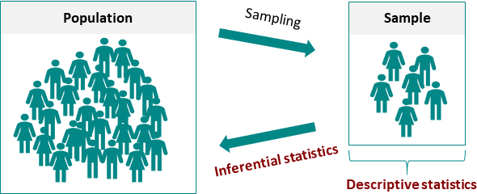

> "R is a language designed to get shit done"  --- hadley wickham


# 描述性统计 vs 推断性统计

推断统计是从整体分布中抽取样本，然后使用该样本对整体分布进行推断。

```{r, out.width='85%', echo = F}

```

为了实现这一点，在推断统计中会使用假设检验，如t检验或方差分析。


# 阿尔茨海默病

假定有个研究药物AD-x37，这是一种理论药物，
已被证明在阿尔茨海默病 (Alzheimer’s disease) 小鼠模型中具有有益的结果。
在目前的临床实验中，我们将从统计学上测试该药物是否能有效减少痴呆患者的认知下降。


## 加载宏包

首先，我们需要
- 加载`tidyverse`宏包，这个宏包包括了`ggplot2` (绘图), `dplyr`/`tidyr` (数据统计和规整)。
- 加载`readxl`宏包，用于读取excel文件。
- 加载`broom`宏包，这个宏包也属于`tidyverse`家族，用于规整模型输出结果。
- 加载`here`宏包，更方便地找到想要的文件。

```{r, message = FALSE, warning = FALSE}
library(tidyverse) # plotting, cleaning, etc
library(readxl)    # read in Excel files
library(broom)     # nice statistical outputs
library(here)      # nice file paths
```


## 读取数据

```{r}
df <- readxl::read_xlsx(here::here("data", "ad_treatment.xlsx"))
df
```


这里使用 MMSE (mini-mental status exam) 分数来评估认知障碍的程度。在一个真实临床试验中，会记录许多其他变量，
但为了一个简单，我们只使用MMSE。总的来说，这个分值越低，说明认知问题越严重。


```{r, out.width='100%', fig.align='center', fig.cap='Source: Folstein et al, 1975, J Psychiatr Res 12:189–198', echo = F}

```

## 探索

- 缺失值的检查
```{r}
df %>% 
  summarise(
    across(everything(), ~sum(is.na(.x)))
  )
```

- 患者年龄的最大和最小值

```{r}
# tidyverse way for range
df %>% 
  summarize(
    min = min(age),
    max = max(age)
  )
```


```{r}
range(df$age)
```


- 患者年龄的分布

```{r}
df %>% 
  ggplot(aes(x = age)) +
  geom_histogram()
```

- 统计分组实验下每组的人数(drug_treatment,  health_status)
  
```{r}
df %>% 
  count(drug_treatment, health_status) 
```


- 每组实验下的认知评估得分的均值

```{r}
df %>% 
  group_by(drug_treatment, health_status) %>% 
  summarise(
    mean_mmse = mean(mmse)
  )
```

**课堂练习**，上面两个问题写在一起？


- 画出不同药物疗法下认知得分
```{r}
df %>% 
  ggplot(aes(x = drug_treatment, y = mmse, color = drug_treatment)) +    
  geom_boxplot()
```

```{r}
df %>% 
  ggplot(aes(x = drug_treatment, y = mmse, color = drug_treatment)) +    
  geom_boxplot() +
  facet_wrap(vars(health_status))
```


- 上图并不完美，我们可以稍微修改下比如

    1. 调整x轴标签的顺序，Placebo < Low dose < High Dose
    2. 分面小图，让Healthy在前面


我们先看看(drug treatment, health status, sex)变量类型，

```{r}
glimpse(df)
```


我们需要调整变量的类型

|  变量          	|  原来的类型 	|  需要转换成 	|
|----------------	|:-----------:	|:-----------:	|
| sex            	|     dbl     	|     fct     	|
| health status  	|     chr     	|     fct     	|
| drug treatment 	|     chr     	|     fct     	|


```{r}
new_df <- df %>%
  mutate(
    sex            = factor(sex, levels = c(0, 1), labels = c("female", "male")),
    drug_treatment = factor(drug_treatment, levels = c("Placebo", "Low dose", "High Dose")),
    health_status  = factor(health_status, levels = c("Healthy", "Alzheimer's"))
  )

glimpse(new_df)
```


```{r}
new_df %>% 
  ggplot(aes(x = drug_treatment, y = mmse, color = drug_treatment)) +    
  geom_boxplot() +
  facet_wrap(vars(health_status))
```


- 在上图的基础上，再以性别分组
```{r}
new_df %>% 
  ggplot(aes(x = drug_treatment, y = mmse, color = drug_treatment)) +    
  geom_boxplot() +
  facet_grid(vars(sex), vars(health_status))
```


# 提问
## 两组(健康组和患有疾病组)均值，是否显著不同？

从统计学角度讲，需要用到t检验，常用函数`t.test()`，这个函数的功能非常丰富

- `one sample t-test`，检验样本的均值是否为固定值 mu

```{r, eval=FALSE}
t.test(data_df$dependent_variable, mu = 0) 
t.test(dependent_variable ~ 1, data = data_df) 
```


- `independent sample t-test`，检验两个样本的均值是否相等

```{r, eval=FALSE}
t.test(dependent_variable ~ independent variable, data = data_df) 
```


- `paired samples t test`，重复测量的样本

```{r, eval=FALSE}
t.test(dependent_variable ~ independent variable, paired = TRUE, data = data_df) 
```


```{r, out.width='85%', fig.align='center', echo = F}

```


## 回到问题上

两组(健康组和患有疾病组)均值，是否显著不同？

我们会用到`independent t-test`，在使用之前，我们需要明确它有几个**假定条件**：

- 两个样本是独立的
- 两个样本均服从正态分布


`t.test()`比较的是两个样本的**均值**。

- 零假设(H0):   µ1 = µ2，两个样本的均值是相等
- 备选假设(Ha): 两个样本的均值不同

```{r, out.width='50%', fig.align='center', echo = F}

```


```{r}
t.test(mmse ~ health_status, data = new_df)
```


看专家怎么说
```{r}
library(report)
mod1 <- t.test(mmse ~ health_status, data = new_df)
report(mod1)
```


将数据可视化和统计建模作是数据分析的两个不同阶段，`ggstatsplot`宏包将他们融为一体，生成的图片可以直接用于发表。我认为，它更大的价值在与，检验我们对统计结果的理解。

```{r}
library(ggstatsplot)
ggbetweenstats(
  data = new_df,
  x = health_status,
  y = mmse 
)
```


分组再做t检验
```{r}
library(rstatix)
new_df %>% 
  group_by(drug_treatment) %>% 
  t_test(mmse ~ health_status)
```


```{r, fig.width= 10}
grouped_ggbetweenstats(
  data = new_df,
  grouping.var = drug_treatment,
  x = health_status,
  y = mmse 
)
```


## 不同健康状态、不同的治疗方法对结果是否有显著影响？

回答这个问题，需要用到方差分析(ANOVA)，方差分析用于检验三个或者三个以上的样本是否存在显著差异。
方差分析比较的是各组的**均值**和**方差**。

- 零假设(H0):    µ1 = µ2 = µ3 = … = µk  (每组的均值都相同)
- 备选假设(Ha):  至少有一个均值与众不同。


方差分析，包含以下常见情形

- One-factor (or one-way) ANOVA
- Two-factors (or two-way) ANOVA
- One-factor ANOVA with repeated measurements
- Two-factors ANOVA with repeated measurements

```{r, out.width='85%', fig.align='center', echo = F}

```


方差分析用到`aov()`函数，基本语法如下：

```{r, eval = F}
aov(dependent_variable ~ independent variable, data = data_df)
```

多个解释变量的时候，就用 `+` 添加解释变量

```{r, eval = F}
aov(mmse ~ drug_treatment + health_status, data = new_df)
```

可添加相互项
```{r, eval = F}
aov(mmse ~ health_status + drug_treatment + health_status:drug_treatment, data = new_df) 
```

更简洁的写法
```{r, eval = F}
aov(mmse ~ health_status * drug_treatment, data = new_df) 
```

注意： `+`, `*` 和 `:` 的区别


## 回到问题上

我们先看四个问题的解决方案

```{r, out.width='100%', fig.align='center', echo = F}

```

将两个解释变量一并考虑到模型中，即假定影响认知得分的因素包括**健康状态**和**药物疗法**以及彼此**相互作用项**。

```{r}
# this gives main effects AND interactions
ad_aov <- aov(mmse ~  drug_treatment * health_status, data = new_df)
```


```{r}
# look at effects and interactions
summary(ad_aov)
```


结果可以看到：
-  health status 因素， p value < 2e-16， 
   **说明**，health status 对认知表现有显著影响，即患有Alzheimer疾病的人，认知能力明显低于健康人群；

-  drug treatment 因素，p value < 2e-16， 
   **说明**，药物治疗方法对认知能力的提升有明显地改进作用。

-  交互项，p value < 2e-16， 
   **说明**，药物作用的大小也依赖健康状态。


 
看专家怎么说

```{r}
report(ad_aov)
```

可以将统计结果，规整成数据框，便于查看和下一步分析（我们会在明天专门讲这个包的妙处）
```{r}
broom::tidy(ad_aov)
```


## Post-hocs

方差分析的结果有个缺陷，对于因素中有多组，只要因素中有两组显著不同，就报告说这个因素有显著作用。
比如这里的药物治疗方法，通过p值，我们知道，药物治疗方法对认知能力的提升有明显地改进作用，
但我们不知道显著差异来自 high dose? Low dose? Both?


```{r}
# call and tidy the tukey post hoc
ad_aov %>% 
  TukeyHSD(which = "drug_treatment") %>%
  tidy() 
```


```{r}
ad_aov %>% 
  TukeyHSD(which = "drug_treatment:health_status") %>%
  tidy() 
```
