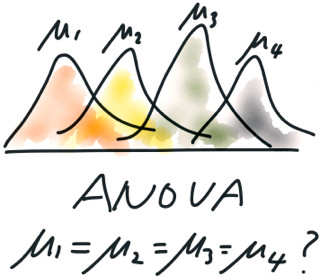
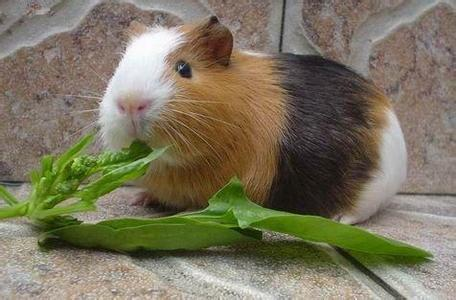
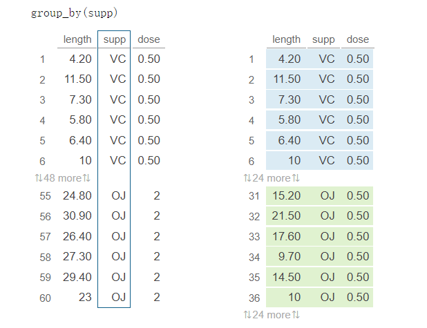
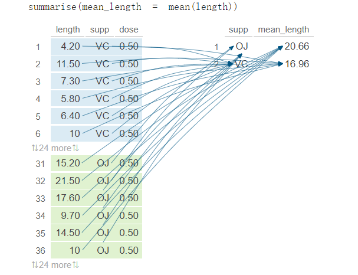
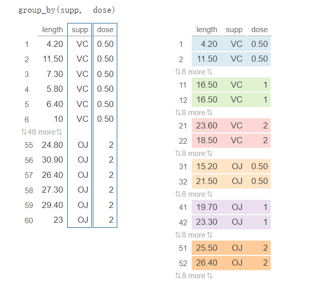
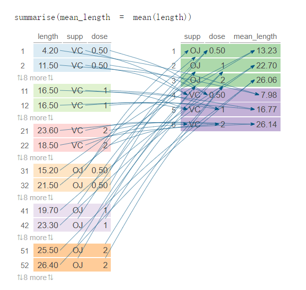

```{r, include = F}
# This is the recommended set up for flipbooks
# you might think about setting cache to TRUE as you gain practice --- building flipbooks from scratch can be time consuming
knitr::opts_chunk$set(
  fig.width = 7, 
  fig.height = 5,
  fig.retina = 2,
  fig.align = "center",
  out.width = "100%",
  dpi = 300,
  message = FALSE, 
  warning = FALSE, 
  comment = "", 
  cache = F
  )
library(flipbookr)
library(tidyverse)
```

```{r setup, include=FALSE}
knitr::opts_hooks$set(fig.callout = function(options) {
  if (options$fig.callout) {
    options$echo <- FALSE
    options$out.height <- "99%"
    options$fig.width <- 16
    options$fig.height <- 8
  }
  options
})

options(
  htmltools.dir.version = FALSE,
  width = 90,
  max.print = 9999,
  knitr.table.format = "html",
  crayon.enabled = TRUE
)
```

---
layout: true
# 应用场景
---

研究某种药物的疗效，一般采用**大样本随机双盲对照试验**，**比较**在特定条件下被试的反应，获取相关数据后，会进行.red[组内比较]或者.red[组间比较]：

- .red[组内比较]， 同一组人，每个人要完成多次测量（重复测量），比如服药第一天的情况，服药第二天的情况，服药第三天的情况...，每组的人数是恒定的。

- .red[组间比较]，`A`组的被试吃1mg，`B`组被试吃2mg, `C`组吃3mg...，每组的人数不要求是恒定的。


--

.pull-left[
<br>

 这个过程可能会使用✍

✅  T检验 t.test<br>
✅  方差分析 ANOVA (ANalysis Of VAriance)<br>

]


.pull-right[

```{r echo=FALSE, out.width = '50%', fig.pos= "center", dpi = 300}

```
]


---
layout: false
class: inverse, center, middle
# 从一个案例开始


---
layout: true
# 豚鼠的牙齿
---

.pull-left[
这个数据集记录着 60 只.red[豚鼠]在不同的摄入方法和不同维生素剂量下，牙齿的生长情况

- length : 牙齿长度
- supp   : 两种摄入方法 (橙汁和维生素片)
- dose   : 维生素剂量 (0.5, 1, and 2 mg/day) 

]


.pull-right[

```{r echo=FALSE, out.width = '100%', fig.pos= "center", dpi = 300}

```
]


---
layout: true
# 豚鼠的牙齿生长
---


.pull-left[

读入数据
```{r message=FALSE, warning=FALSE}
library(tidyverse)

ToothGrowth <- 
  read_csv("./data/ToothGrowth.csv") %>% 
  mutate(
    across(c(dose, supp), as.factor)
  )
```

]

--

.pull-right[

数据长成这个样子

```{r, echo = FALSE}
ToothGrowth %>% 
  head(12) %>% 
  knitr::kable() 
```

]


---
layout: false
class: inverse, center, middle
# 问题一：喝橙汁 vs 吃药片，谁的牙齿长？


---
layout: true
# 先画图看看
---

```{r, fig.asp = 0.8, out.width= "45%", dpi = 300}
ToothGrowth %>%
  ggplot(aes(x = supp, y = length)) +
  geom_point() #<<
```

---
layout: true
# 先画图看看
---

```{r, fig.asp = 0.8, out.width= "45%", dpi = 300}
ToothGrowth %>%
  ggplot(aes(x = length)) +
  geom_density(aes(color = supp))  #<<
```

---
layout: true
# 先画图看看
---

```{r, fig.asp = 0.8, out.width= "45%", dpi = 300}
ToothGrowth %>%
  ggplot(aes(x = supp, y = length)) +
  geom_boxplot(alpha = 0.3)    #<<
```


---
layout: true
# 先画图看看
---

```{r, fig.asp = 0.8, out.width= "45%", dpi = 300}
ToothGrowth %>%
  ggplot(aes(x = supp, y = length)) +
  geom_boxplot(alpha = 0.3) +   
  geom_jitter()                 #<<
```


---
layout: true
# 计算两种摄入方法下，牙齿长度的均值
---

分组统计均值，第一步

.pull-left[
```{r, eval=FALSE}
ToothGrowth %>% 
  group_by(supp) #<<
```
]


.pull-right[

```{r echo=FALSE, out.width = '100%', fig.pos= "center", dpi = 300}

```
]


---
layout: true
# 计算两种摄入方法下，牙齿长度的均值
---

分组统计均值，第二步

.pull-left[
```{r, eval=FALSE}
ToothGrowth %>% 
  group_by(supp) %>% 
  summarise(
    mean_length = mean(length) #<<
  )
```
]


.pull-right[

```{r echo=FALSE, out.width = '100%', fig.pos= "center", dpi = 300}

```
]


---
layout: true
# 计算两种摄入方法下，牙齿长度的均值
---

```{r}
ToothGrowth %>% 
  group_by(supp) %>% 
  summarise(
    mean_length = mean(length)
  ) %>% 
  knitr::kable() 
```


---
layout: true
# 喝橙汁的豚鼠比吃维生素片的牙齿要长？
---

--

从统计学角度回答，.blue[双样本T检验](这里supp的层级只有2层)或者.blue[单因素方差分析]都是可以的

--

```{r, eval=FALSE}
t.test(length ~ supp, data = ToothGrowth) #<<
```

--
```{r, echo=FALSE}
t.test(length ~ supp, data = ToothGrowth)
```

--
.content-box-purple[
虽然喝橙子的均值要高于吃药片的，但这里p值0.06 > 0.05，而且95%置信区间包含了 0，所以从上述假设模型来看，不能说明喝橙汁的豚鼠一定比吃维生素片的牙齿要长。
]


---
layout: true
# T检验本质上是线性回归
---

```{r, fig.asp= 0.8, out.width= "40%", dpi = 300}
ToothGrowth %>%
  mutate(supp = if_else(supp == "VC", 1, 2)) %>%
  ggplot(aes(x = supp, y = length)) +
  geom_point() +
  stat_summary(
   fun = mean,
   geom = "point",
   color = "red",
   size = 3
  ) +
  geom_smooth(method = "lm") #<<
```


---
layout: true
# T检验本质上是线性回归
---

.pull-left[

使用 `t.test()`
```{r}
t.test(length ~ supp, data = ToothGrowth) #<<
```

]


.pull-right[

使用 `lm()`
```{r}
tbl <- ToothGrowth %>% 
  mutate(supp = fct_rev(supp))


model <- lm(length ~ supp, data = tbl) #<<

confint(model)
```

<br>
可以看到，95%的置信区间与用`t.test()`的结果一致。

]


---
layout: true
# 看专家怎么说`r emo::ji("pencil")`
---

--

从[CRAN](https://github.com/easystats/report)上安装宏包`report` 

```{r, eval=FALSE}
install.packages("report")
```

--

```{r, eval=FALSE}
library(report)    
mod1 <- t.test(length ~ supp, data = ToothGrowth)

report(mod1)
```


.content-box-green[

Effect sizes were labelled following Cohen's (1988) recommendations.

The Welch Two Sample t-test testing the difference of length by supp (mean in group OJ = 20.66, mean in group VC = 16.96) suggests that the effect is positive, statistically not significant, and medium (difference = 3.70, 95% CI [-0.17, 7.57], t(55.31) = 1.92, p = 0.061; Cohen's d = 0.52, 95% CI [-0.02, 1.05])

]


---
layout: true
# 推荐 ggstatsplot 👍

---


--

从[CRAN](https://cran.r-project.org/web/packages/ggstatsplot/index.html)上安装宏包`ggstatsplot` 

```{r, eval=FALSE}
install.packages("ggstatsplot")
```

--

也可以从[Github](https://github.com/IndrajeetPatil/ggstatsplot)安装它的开发版本

```{r, eval=FALSE}
remotes::install_github("IndrajeetPatil/ggstatsplot")
```

--

使用该宏包

```{r, eval=TRUE, warning=FALSE}
library(ggstatsplot)
library(ggplot2)
```


---
layout: true
# ggbetweenstats() 组间比较
---

--

.left-code[
```{r ggbetweenstats_1, eval=FALSE}
library(ggstatsplot)
ggbetweenstats(
  data = ToothGrowth,
  x = supp,
  y = length
)
```

.font70[
Function internally decides tests

- *t*-test if `2` groups
- ANOVA if `> 2` groups

`r emo::ji("pencil")` .blue[Defaults] return <br>

✅ raw data + distributions <br>
✅ descriptive statistics <br>
✅ inferential statistics <br>
✅ effect size + CIs <br>
✅ pairwise comparisons <br>
✅ Bayesian hypothesis-testing <br>
✅ Bayesian estimation
]

]

--

.right-plot[
```{r ggbetweenstats_1_callout, ref.label='ggbetweenstats_1', echo=FALSE}
```
]


---
layout: true
# 统计含义 🏆
---

```{r echo=FALSE, out.width = '100%', fig.pos= "center"}
knitr::include_graphics("images/stats_reporting_format.png")
```


---
layout: false
class: inverse, center, middle
# 问题二：维生素摄入剂量对豚鼠牙齿生长是否存在显著影响？


---
layout: true
# 先画图看看
---

```{r, fig.asp = 0.8, out.width= "45%", dpi = 300}
ToothGrowth %>%
  ggplot(aes(x = dose, y = length)) +
  geom_boxplot(alpha = 0.3) +   
  geom_jitter()   
```


---
layout: true
# 计算不同摄入剂量下，牙齿长度的均值
---

```{r}
ToothGrowth %>% 
  group_by(dose) %>% 
  summarise(
    mean_length = mean(length)
  ) %>% 
  knitr::kable() 
```


---
layout: true
# 计算不同摄入剂量下，牙齿长度的显著不同？
---


--

`r emo::ji("x")` T 检验
```{r, error=TRUE}
t.test(length ~ dose, data = ToothGrowth) #<<
```


--

✅  单因素方差分析


```{r}
aov(length ~ dose, data = ToothGrowth) %>%  #<<
  summary()
```


---
layout: true
# 组间比较
---


--

.left-code[
```{r ggbetweenstats_2, eval=FALSE}
library(ggstatsplot)

ggbetweenstats(
  data = ToothGrowth,
  x = dose,   #<<
  y = length
)
```
]

--

.right-plot[
```{r ggbetweenstats_2_callout, ref.label='ggbetweenstats_2', echo=FALSE}
```
]


---
layout: false
class: inverse, center, middle
# 问题三：维生素摄入方法和剂量对豚鼠牙齿生长是否存在显著影响？


---
layout: true
# 分组画图看看
---

```{r, fig.asp= 0.65, out.width= "55%", dpi = 300}
ToothGrowth %>%
  ggplot(aes(x = supp, y = length, fill = supp)) +
  geom_boxplot() +
  facet_wrap(vars(dose)) +
  labs(title = "维生素摄入方法和剂量对豚鼠牙齿生长的影响")
```


---
layout: true
# 分组统计均值，第一步
---

.pull-left[
```{r, eval=FALSE}
ToothGrowth %>% 
  group_by(supp, dose) #<<
```
]


.pull-right[

```{r echo=FALSE, out.width = '100%', fig.pos= "center"}

```
]


---
layout: true
# 分组统计均值，第二步
---

.pull-left[
```{r, eval=FALSE}
ToothGrowth %>% 
  group_by(supp, dose) %>% 
  summarise(
    mean_length = mean(length)  #<<
  )
```
]


.pull-right[

```{r echo=FALSE, out.width = '100%', fig.pos= "center"}

```
]


---
layout: true
# 不同摄入方法和不同摄入剂量下，牙齿长度的均值
---

```{r}
ToothGrowth %>% 
  group_by(supp, dose) %>% 
  summarise(
    mean_length = mean(length)
  ) %>% 
  knitr::kable() 
```


---
layout: true
# 摄入方法和剂量，对豚鼠牙齿生长是否存在显著影响？
---


--

这里是两个解释变量，所以需要双因素方差分析 (ANOVA)

--

```{r}
aov(length ~ supp + dose, data = ToothGrowth) %>% #<<
  summary()
```

--

<br>
.content-box-green[
表明摄入方法、摄入剂量对牙齿长度的影响都是显著的。
]


---
layout: true
# 看专家怎么说
---


```{r, eval=FALSE}
library(report)
mod2 <- aov(length ~ supp + dose, data = ToothGrowth)

report(mod2)
```

.content-box-red[

The ANOVA (formula: length ~ supp + dose) suggests that:

  - The main effect of supp is statistically significant and large (F(1, 56) = 14.02, p < .001; Eta2 (partial) = 0.20, 95% CI [0.07, 1.00])
  - The main effect of dose is statistically significant and large (F(2, 56) = 82.81, p < .001; Eta2 (partial) = 0.75, 95% CI [0.65, 1.00])

Effect sizes were labelled following Field's (2013) recommendations.

]


---
layout: false

class: inverse, center, middle

# 问题四：在不同剂量下，两种摄入方法对结果是否存在显著影响？


---
layout: true
# 不同剂量下，摄入方法对结果是否存在显著影响？
---

```{r, fig.asp = 0.8, out.width= "45%", dpi = 300}
ToothGrowth %>%
  ggplot(aes(x = dose, y = length, color = supp)) +
  geom_boxplot(alpha = 0.3, position = position_dodge(0.8)) +
  geom_jitter(position = position_jitterdodge(dodge.width = 0.8) ) +
  theme_classic()
```


---
layout: true
# 不同剂量下，摄入方法对结果是否存在显著影响？
---

使用 `tidyverse` 方法

```{r}
ToothGrowth %>%
  group_by(dose) %>%
  group_modify(
    ~ t.test(length ~ supp, data = .x) %>%
      broom::tidy()
  ) %>% 
  select(1:9) %>% 
  knitr::kable()
```

---
layout: true
# 不同剂量下，摄入方法对结果是否存在显著影响？
---

使用 `rstatix::t_test()` 方法

```{r}
library(rstatix)
ToothGrowth %>%
  group_by(dose) %>%
  rstatix::t_test(length ~ supp) %>% 
  knitr::kable()
```


---
layout: true
# 不同剂量下，摄入方法对结果是否存在显著影响？
---

使用 `ggstatsplot()` 宏包

```{r ggbetweenstats_3, eval=FALSE}
ToothGrowth %>% 
  ggstatsplot::grouped_ggbetweenstats(
    x = supp,
    y = length,
    grouping.var = dose,   #<<
    pairwise.display = "all"
  )
```


---
layout: true
# 不同剂量下，摄入方法对结果是否存在显著影响？
---

```{r ggbetweenstats_3_callout, ref.label='ggbetweenstats_3', echo=FALSE, out.height = "100%", fig.width  = 12, fig.height = 6, out.width= "100%", dpi=600}
```


---
layout: false
class: inverse, center, middle

# 感谢 R 语言之美!

本幻灯片由 R 包 [xaringan](https://github.com/yihui/xaringan) 和 [flipbookr](https://github.com/EvaMaeRey/flipbookr) 生成 🙌


