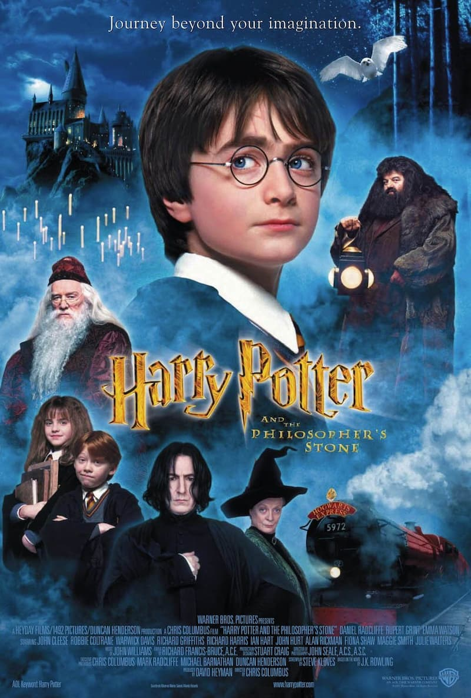
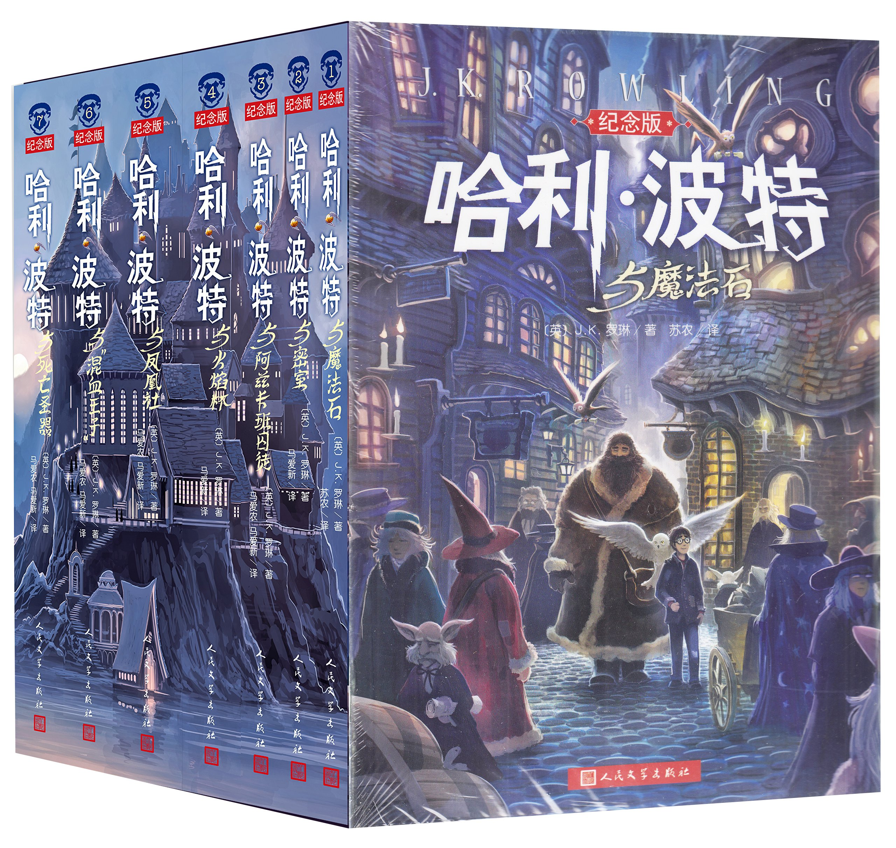

```{r setup, include=FALSE}
knitr::opts_chunk$set(
  echo = TRUE,
  message = FALSE,
  warning = FALSE,
  fig.align = "center"
)
```


```{r xaringan-panelset, echo=FALSE}
xaringanExtra::use_panelset()
```


## 缘起

.pull-left[

哈利波特系列电影很受小朋友们喜欢，我也很喜欢

```{r, out.width = '55%', echo = FALSE, fig.pos = "center"}

```

]


--

.pull-right[

但是，我们今天谈的是J. K. Rowling女士的小说：

```{r, out.width = '45%', echo = FALSE, fig.pos = "center"}

```


- 首先，小说文本进行一些基本的词频分析
- 然后，了解文本中的观点或情感（情感分析）
- 本案例建立在[tidytext](https://tidytextmining.com/)宏包的基础上


]


---
class: center, middle
# 一、准备工作


---
## 什么是文本数据?

```{r}
# 加载必要的宏包
library(tidyverse)
library(stringr)
library(tidytext)
```


```{r}
df <- tibble(
  id = c(1, 2),
  text = c("This is a cat, i like it.", "I love Plato, but I love Truth more.")
)

df
```

---

## 分词

什么叫分词？

--

.pull-left[

```{r}
df %>%
  unnest_tokens(word, text, token = "words")
```


]


--


.pull-right[

```{r}
df %>%
 unnest_tokens(word, text, token="sentences")
```

]


---

## 停用词(stop words)

.pull-left[

什么是停用词？

```{r}
stop_words
```

]


--

.pull-right[

利用stop_words，过滤掉文本中的停用词

```{r}
df %>%
  unnest_tokens(word, text) %>%
  anti_join(stop_words, by = "word") #<<
```

]


---

## 情感数据集

情感数据集也叫[情感字典](https://www.tidytextmining.com/sentiment.html)，用于评估文本中的观点或情感。`tidytext`包在sentiments数据集中包含了三个情感词典。

```{r}
sentiments
```

---

## 情感数据集

三个情感词库：

- nrc词库，将单词分为积极、消极、愤怒、期待、厌恶、恐惧、快乐、悲伤、惊讶和信任等类别。
- bing词库，以二元方式将单词分为积极和消极类别。
- AFINN词库，给单词打分，分数在-5到5之间，负分表示消极情绪，正分表示积极情绪。


.panelset[

.panel[.panel-name[nrc词库]

```{r}
get_sentiments("nrc")
```
]

.panel[.panel-name[bing词库]

```{r}
get_sentiments("bing")
```

]


.panel[.panel-name[AFINN词库]

```{r}
get_sentiments("afinn")
```
]

]


---


## 单词的情感
```{r}
df %>%
  unnest_tokens(word, text) %>%
  inner_join(get_sentiments("nrc")) #<<
```

---

## 简单统计

```{r}
df %>%
  unnest_tokens(word, text) %>%
  inner_join(get_sentiments("nrc")) %>%
  count(sentiment, sort = TRUE) #<<
```

---
class: center, middle
# 二、我们开始探索


---
## 哈利波特数据集

```{r}
library(harrypotter)
```

安装这个宏包
```{r, eval=FALSE}
devtools::install_github("bradleyboehmke/harrypotter")
```

| 英文名                	| 中文名                        	| 年份   	|
|-----------------------	|-------------------------------	|--------	|
| philosophers_stone    	|     《哈利·波特与魔法石》     	| (1997) 	|
| chamber_of_secrets    	|      《哈利·波特与密室》      	| (1998) 	|
| prisoner_of_azkaban   	| 《哈利·波特与阿兹卡班的囚徒》 	| (1999) 	|
| Goblet_of_fire        	|     《哈利·波特与火焰杯》     	| (2000) 	|
| Order_of_the_phoenix  	|     《哈利·波特与凤凰社》     	| (2003) 	|
| half_blood_prince     	|    《哈利·波特与混血王子》    	| (2005) 	|
| deathly_hallows       	|    《哈利·波特与死亡圣器》    	| (2007) 	|


---

## 文本形态

每本书的文本都存放在一个字符串向量中，也就说，一本书对应这一个向量。书中有几章，向量就有几个元素。

--
```{r}
typeof(philosophers_stone)
```

--
```{r}
length(philosophers_stone)
```

--
```{r}
philosophers_stone[1:2]
```

---

## 数据归集

七本《哈利波特》小说合并到一起
```{r}
raw <- list(
  philosophers_stone   = philosophers_stone,
  chamber_of_secrets   = chamber_of_secrets,
  prisoner_of_azkaban  = prisoner_of_azkaban,
  goblet_of_fire       = goblet_of_fire,
  order_of_the_phoenix = order_of_the_phoenix,
  half_blood_prince    = half_blood_prince,
  deathly_hallows      = deathly_hallows
)
```

---

## 转换成更方便的格式

为了方便分析，需要将数据整理成一个整齐的**数据框**格式

```{r}
raw %>%
  map_dfr(
    ~ tibble(chapter = 1:length(.x), text = .x),
    .id = "book"
  ) 
```


---

## 分词

变成了一个更大的数据框，按(书名-章节-单词)排列

```{r}
hp_words <- raw %>%
  map_dfr(
    ~ tibble(chapter = 1:length(.x), text = .x),
    .id = "book"
  ) %>%
  unnest_tokens(word, text, token = "words") #<<


hp_words %>% head()
```

---

## 过滤掉停用词
```{r}
hp_words %>%
  group_by(book, word) %>%
  anti_join(stop_words, by = "word") #<<
```

---

## 统计每本书的词频
```{r}
hp_words %>%
  group_by(book, word) %>%
  anti_join(stop_words, by = "word") %>%
  count() %>%      #<<
  arrange(desc(n)) #<<
```

---

## 每本书词频最高的前15个词
```{r}
tbl <- hp_words %>%
  group_by(book, word) %>%
  anti_join(stop_words, by = "word") %>%
  count() %>%
  arrange(desc(n)) %>%
  group_by(book) %>%
  mutate(top = seq_along(word)) %>% #<<
  filter(top <= 15) %>%             #<<
  arrange(book, top)

tbl
```


---

## 可视化

```{r, fig.width= 14}
tbl %>%
  ggplot(aes(x = n, y = fct_reorder(word, n), fill = book)) +
  geom_col(color = "black") +
  facet_wrap(vars(book), scale = "free_y", nrow = 1) +
  theme(legend.position = "none")
```


---
class: center, middle
# 三、情感分析


---
## 情感评估

使用`nrc`情感数据集来评估整个《哈利波特》系列所代表的不同情感。

```{r}
hp_words %>%
  inner_join(get_sentiments("nrc")) %>% #<<
  count(sentiment, sort = TRUE)
```

我们可以看到，负面情感的存在比正面情感更强烈。


---

## 情感是如何流动的

之前给出了一个很好的整体感觉，但如果我们想了解每部小说的过程中情感是如何变化的呢？要做到这一点，我们要进行以下工作。

- 创建一个索引，将每本书按500个词分开；这是每两页的大致字数，所以这将使我们能够评估情感的变化，甚至是在章节中的变化
- 用`inner_join()`连接bing词典，以评估每个词的正面和负面情感
- 计算每两页有多少个正面和负面的词
- 数据整理成宽表格
- 计算出净情感（正面情感减去负面情感）
- 可视化


---

## 情感是如何流动的

```{r tiny-plot, eval=FALSE}
hp_words %>%
  group_by(book) %>%
  mutate(
    word_count = 1:n(),
    index = word_count %/% 500 + 1
  ) %>%
  inner_join(get_sentiments("bing"), by = "word") %>%
  count(book, index = index, sentiment) %>%
  ungroup() %>%
  pivot_wider(names_from = sentiment, values_from = n, values_fill = 0) %>%
  mutate(sentiment = positive - negative) %>%
  ggplot(aes(index, sentiment, fill = book)) +
  geom_col(alpha = 0.5, show.legend = FALSE) +
  facet_wrap(vars(book), ncol = 2, scales = "free_x")
```


---

## 情感是如何流动的

.plot-callout[
```{r tiny-plot-callout, ref.label="tiny-plot", fig.callout=TRUE, echo=FALSE}

```
]


---

## 不同情感库、小说有不同情感波动

这里有三个情感词典，让它们分别评估小说，比较它们的不同之处，然后选择哪个情感词典更适合我们的目标。

.pull-left[

```{r}
bing <- hp_words %>%
  group_by(book) %>%
  mutate(
    word_count = 1:n(),
    index = word_count %/% 500 + 1
  ) %>%
  inner_join(get_sentiments("bing")) %>%  #<<
  mutate(method = "Bing")

nrc <- hp_words %>%
  group_by(book) %>%
  mutate(
    word_count = 1:n(),
    index = word_count %/% 500 + 1
  ) %>%
  inner_join(get_sentiments("nrc") %>%    #<<
    filter(sentiment %in% c("positive", "negative"))
  ) %>%
  mutate(method = "NRC")
```

]

--

.pull-right[

```{r}
afinn <- hp_words %>%
  group_by(book) %>%
  mutate(
    word_count = 1:n(),
    index = word_count %/% 500 + 1
  ) %>%
  inner_join(get_sentiments("afinn")) %>% #<<
  group_by(book, index) %>%
  summarise(sentiment = sum(value)) %>%
  mutate(method = "AFINN")

bing_and_nrc <- bind_rows(bing, nrc) %>% 
  count(book, method, index = index, sentiment) %>%
  ungroup() %>%
  pivot_wider(
    names_from = sentiment,
    values_from = n,
    values_fill = 0
  ) %>%
  mutate(sentiment = positive - negative) %>%
  select(book, index, method, sentiment)
```

]


---
## 小说文本在不同情感库中的表现

我们现在有了三个情感词库对小说文本中净情感（正面-负面）的估计，然后我们把它们绘制出来。


```{r small-plot, eval=FALSE}
afinn %>%
  bind_rows(bing_and_nrc) %>%  
  ggplot(aes(index, sentiment, fill = method)) +
  geom_col(alpha = 0.8, show.legend = FALSE) +
  facet_grid(book ~ method)
```


---
## 小说文本在不同情感库中的表现
.pull-left[

.plot-callout[
```{r small-plot-callout, ref.label="small-plot", fig.callout=TRUE, echo=FALSE, out.width="100%"}

```
]

]

--

.pull-left[

<br><br>
#### 给出的结果

- 三种词典给出的小说情感在绝对意义上是不同的，
- 但是，它们有非常相似的相对轨迹（差不多相同的地方有类似的情绪低谷和高峰）。
- 在某些情况下，AFINN词典似乎比NRC词典发现了更多积极的情绪。

]

---

## 积极情感下，哪些单词出现的最多？

单词和情感在一个数据框中，这样非常方便统计每种情感下有贡献的单词数。

```{r}
bing_word_counts <- hp_words %>%
  inner_join(get_sentiments("bing")) %>%
  count(word, sentiment, sort = TRUE) %>%
  ungroup()

bing_word_counts
```

---
## 使用频次最高的情感词


.left-code[
```{r plot-label, eval=FALSE}
bing_word_counts %>%
  group_by(sentiment) %>%
  slice_max(n, n = 10) %>%
  ungroup() %>%
  mutate(word = reorder(word, n)) %>%
  ggplot(aes(n, word, fill = sentiment)) +
  geom_col(show.legend = FALSE) +
  facet_wrap(~sentiment, scales = "free_y") +
  labs(
    x = "Contribution to sentiment",
    y = NULL
  )
```
]

.right-plot[
```{r plot-label-out, ref.label="plot-label", echo=FALSE, out.width="80%"}

```
]


---
class: center, middle
# 四、以句子为单位的情感分析


---
## 以句子为单位的情感分析

之前的分析，都是以一个词(word)为单位，现在我们以句(sentences)为单位。

> I am not having a good day.

是一个悲伤的句子，而不是一个快乐的句子，因为有否定词。


**因此，我们可能需要按章节和句子来评估情感。**


---
## 以句子为单位的情感分析

使用philosophers_stone数据集来说明。

```{r}
ps_sentences <-
  tibble(
    chapter = 1:length(philosophers_stone),
    text = philosophers_stone
  ) %>%
  unnest_tokens(sentence, text, token = "sentences") #<<
ps_sentences
```


---
## 以句子为单位的情感分析


为了能够按章节和句子来评估净情绪，

- 首先，我们需要设定句子的编号，并创建一个索引，追踪句子在章节中的进度。
- 然后，按单词对句子进行分词，从而得到一个数据框。该数据框中的每个词都能对应到所在句子、所在章节以及所在的书名。
- 最后，加入AFINN词典，并计算每一章的净情感分数。

---
## 第一步 

设定句子的编号，并创建一个索引，追踪句子在章节中的进度。

```{r}
ps_sentences %>%
  group_by(chapter) %>%
  mutate(
    sentence_num = 1:n(), #<<
    index = round(sentence_num / n(), 2) #<<
  ) %>%
  ungroup()
```


---
## 第二步

按单词对句子进行分词，从而得到一个数据框。该数据框中的每个词对应到它所在句子以及所在章节。

```{r}
ps_sentences %>%
  group_by(chapter) %>%
  mutate(
    sentence_num = 1:n(),
    index = round(sentence_num / n(), 2)
  ) %>%
  ungroup() %>%
  unnest_tokens(word, sentence) #<<
```

---
## 第三步

加入AFINN词典，并计算每一章的净情感分数。

```{r}
book_sentiment <- ps_sentences %>%
  group_by(chapter) %>%
  mutate(
    sentence_num = 1:n(),
    index = round(sentence_num / n(), 2)
  ) %>%
  ungroup() %>%
  unnest_tokens(word, sentence) %>%
  inner_join(get_sentiments("afinn")) %>% #<<
  group_by(chapter, index) %>% #<<
  summarise(sentiment = sum(value, na.rm = TRUE)) %>% #<<
  arrange(desc(sentiment))

book_sentiment
```


---
## 第四步

用一个热图来形象地说明，该热图显示了在每一章进展中最积极和最消极的情感。

```{r large-plot, eval=FALSE}
book_sentiment %>%
  ggplot(aes(index, fct_rev(factor(chapter)), fill = sentiment)) +
  geom_tile(color = "white") +
  scale_fill_gradient2() +
  scale_x_continuous(labels = scales::percent, expand = c(0, 0)) +
  scale_y_discrete(expand = c(0, 0)) +
  labs(x = "Chapter Progression", y = "Chapter") +
  ggtitle(
    "Sentiment of Harry Potter and the Philosopher's Stone",
    subtitle = "Summary of the net sentiment score as you progress through each chapter"
  ) +
  theme_minimal() +
  theme(
    panel.grid.major = element_blank(),
    panel.grid.minor = element_blank(),
    legend.position = "top"
  )
```


---
## 第四步


.plot-callout[
```{r large-plot-callout, ref.label="large-plot", fig.callout=TRUE, echo=FALSE, out.width= "55%", fig.asp= 0.8}

```
]


我们可以看到，最积极的句子是第9章的中间部分，第17章的末尾，第4章的前部分等。


---
## 参考

- <https://tidytextmining.com/>
- <https://github.com/EmilHvitfeldt/R-text-data>
- <https://paulvanderlaken.com/2017/08/03/harry-plotter-celebrating-the-20-year-anniversary-with-tidytext-the-tidyverse-and-r/>
- <https://ggplot2.tidyverse.org/>


---
class: center, middle

# 感谢 R 语言的美!

本幻灯片由 R 包 [**xaringan**](https://github.com/yihui/xaringan) 和 [**flipbookr**](https://github.com/EvaMaeRey/flipbookr) 生成
