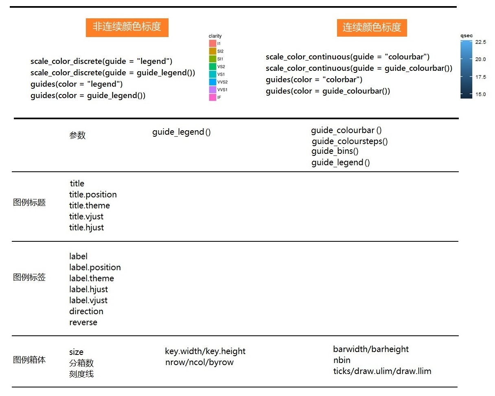

# 图例控制

想调整图例的样式，可以使用`scale_*()`函数或者`guides()`函数

```{r, out.width = '99%', echo = FALSE}

```


以下 `guides()` 函数族用于控制图例的外观

- `guide_colorbar()`: continuous colors
- `guide_legend()`: discrete values (shapes, colors)
- `guide_axis()`: control axis text/spacing, add a secondary axis 
- `guide_bins()`: creates "bins" of values in the legend
- `guide_colorsteps()`: makes colorbar discrete 


```{r out.width = "80%"}
knitr::include_graphics("images/guides_examples.png")
```


```{r, message=FALSE, warning=FALSE}
library(tidyverse)
library(palmerpenguins)
penguins <- penguins %>% 
  drop_na() 
```

## 离散的颜色
```{r}
p1 <- penguins %>% 
  ggplot(aes(x = bill_length_mm, y = bill_depth_mm, color = species)) +
  geom_point()
p1
```


```{r}
p1 + scale_color_discrete(guide = "legend")
p1 + scale_color_discrete(guide = guide_legend())
p1 + guides(color = "legend")
p1 + guides(color = guide_legend())
```


## 连续的颜色
```{r}
p2 <- penguins %>% 
  ggplot(aes(x = bill_length_mm, y = bill_depth_mm, color = body_mass_g)) +
  geom_point()
p2
```


```{r}
p2 + scale_color_continuous(guide = "colourbar")
p2 + scale_color_continuous(guide = guide_colourbar())
p2 + guides(color = "colorbar")
p2 + guides(color = guide_colourbar())
```


```{r}
p2 + scale_color_continuous(guide = "bins")
p2 + scale_color_continuous(guide = guide_bins())
p2 + guides(color = "bins")
p2 + guides(color = guide_bins())
```


```{r}
p2 + scale_color_continuous(guide = "legend")
p2 + scale_color_continuous(guide = guide_legend())
p2 + guides(color = "legend")
p2 + guides(color = guide_legend())
```


```{r}
p2 + scale_color_continuous(guide = "colorsteps")
p2 + scale_color_continuous(guide = guide_colorsteps())
p2 + guides(color = "colorsteps")
p2 + guides(color = guide_colorsteps())
```


# 更多细节
## 离散颜色的图例控制
```{r}
penguins %>% 
  ggplot(aes(x = bill_length_mm, y = bill_depth_mm, color = species)) +
  geom_point() +
  guides(color = guide_legend(
    title = "title is too high",
    title.position = "top",
    title.vjust = 5,
    label.position = "left",
    label.hjust = 1,
    label.theme = element_text(
      size = 15,
      face = "italic",
      colour = "red",
      angle = 0
    ),
    keywidth = 5,
    reverse = TRUE
   )
  )
```


## 连续颜色的图例的样式和外观
```{r}
penguins %>% 
  ggplot(aes(x = bill_length_mm, y = bill_depth_mm, color = body_mass_g)) +
  geom_point() +
  scale_color_continuous(
    guide  = guide_colourbar(),
    name   = "weight",
    limits = c(3000, 7000),
    breaks = c(3000, 4000, 4500, 5000, 7000)
  )
```


```{r}
ggpubr::show_point_shapes()
```


```{r}
penguins %>% 
  ggplot(aes(x = bill_length_mm, y = bill_depth_mm, color = body_mass_g)) +
  geom_point() +
  scale_color_continuous(
    name = "weight",
    limits = c(3000, 7000),
    breaks = c(3000, 4000, 4500, 5000, 7000),
    labels = ~ paste0(.x , "g"),
    guide = guide_legend(
      direction = "vertical",
      label.hjust = 1,
      keyheight = 3,
      keywidth =  3,
      override.aes = list(shape = 19, size = 4),
      title.theme = element_text(
        size = 15,
        face = "italic",
        colour = "red",
        angle = 0
      )
    )
  )
```


```{r}
penguins %>% 
  ggplot(aes(x = bill_length_mm, y = bill_depth_mm, color = body_mass_g)) +
  geom_point() +
  scale_color_continuous(
    name = "weight",
    limits = c(3000, 7000),
    breaks = c(3000, 4000, 4500, 5000, 7000),
    labels = ~ paste0(.x , "g"),
    guide = guide_colorsteps(show.limits = TRUE, 
                             barwidth = 1, 
                             barheight = 10)
  )

```


```{r}
penguins %>% 
  ggplot(aes(x = bill_length_mm, y = bill_depth_mm)) +
  geom_point(aes(size = body_mass_g)) +
  scale_size(
     name   = "企鹅体重",
     range  = c(1, 10),
     breaks = c(3000, 4000, 5000, 6000),
     labels = c("3kg", "4kg", "5kg", "6kg")
   )
```


# 参考

- <https://ggplot2.tidyverse.org/reference/guide_colourbar.html>
